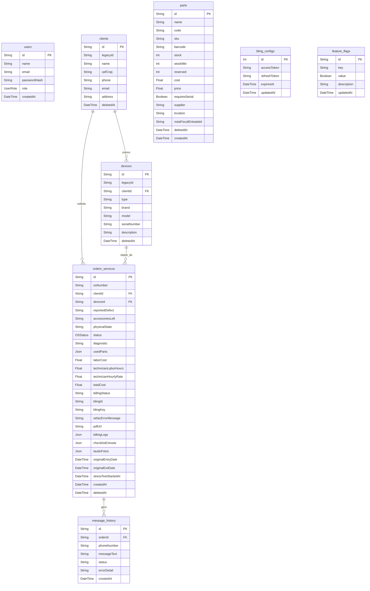

# MGV Sistema Integrado - Base de Conhecimento e Contexto de Projeto

Este documento serve como a **Base de Conhecimento Suprema** para guiar agentes inteligentes (como o Gemini) e novos desenvolvedores sobre o contexto do **MGV Sistema Integrado**. Ele reúne, consolida e explica de forma didática todas as definições de arquitetura, stack tecnológica, modelagem de banco de dados, regras de negócio e boas práticas do projeto.

---

## 🖥️ 1. Visão Geral do Produto

O **MGV Sistema Integrado** é um sistema web proprietário desenvolvido sob medida para a gestão operacional e automação fiscal da assistência técnica da MGV. Ele foi projetado para substituir soluções desktop legadas (como o software *SH Oficina*), modernizando a operação.

### Recursos Principais
*   **Gestão de Ordens de Serviço (OS):** Painel interativo estilo **Kanban** para movimentação de OS em tempo real.
*   **Faturamento e Automação Fiscal:** Integração bidirecional com o **Bling ERP V3** para emissão automática de notas fiscais (SEFAZ), sincronização de clientes e controle financeiro.
*   **Base Instalada de Equipamentos:** Rastreabilidade vitalícia do histórico de manutenção de cada equipamento atrelado ao cliente (conceito inspirado em grandes ERPs como Totvs Protheus).
*   **Módulo de Estoque com Reserva Lógica:** Controle de estoque integrando reservas temporárias em orçamentos/manutenções e baixa definitiva física apenas no faturamento.
*   **Comunicação WhatsApp Automática:** Disparos síncronos e assíncronos baseados em status da OS com controle visual de histórico de mensagens.
*   **Árvore de Habilidades (Skill Tree):** Controle administrativo dinâmico e gamificado de ativação de novas feature flags no sistema.
*   **Portal Público de Acompanhamento:** Espaço de consulta simplificado onde o cliente final acompanha o status do reparo usando CPF/CNPJ e o número da OS, reduzindo chamados de suporte.

---

## 🛠️ 2. Stack Tecnológica (O "Motor" do Sistema)

*   **Frontend (UI/UX):** React.js inicializado com **Vite**. A interface é construída com **TailwindCSS** seguindo um estilo visual premium de **Glassmorphism Dark** (efeitos de vidro translúcido, gradientes vibrantes em tons de *teal* e *indigo* e bordas sutis).
*   **Backend:** Node.js com **Express** e **TypeScript** estruturado para rodar de forma acoplada ao frontend no ambiente de desenvolvimento, provendo APIs de sincronização e manipulação do banco.
*   **Banco de Dados:** **PostgreSQL** hospedado na nuvem pelo **Supabase**.
*   **ORM (Object-Relational Mapping):** **Prisma Client** para modelagem relacional tipada e operações seguras de banco de dados.
*   **Autenticação:** Supabase Auth integrado ao backend, utilizando validação de tokens JWT. Perfis de acesso definidos em nível de governança: `OWNER` (Admin/Gerentes), `EDITOR`, `ATTENDANT`, `TECHNICIAN` e `FINANCIAL`.

---

## 🔌 3. Decisões Arquiteturais e Integrações Críticas

### 3.1. Conexão com Banco de Dados via Pooler (Supabase IPv4)
> [!IMPORTANT]
> A infraestrutura do Render (hospedagem de deploy) e outras semelhantes podem não suportar conexões nativas IPv6. Por isso, a conexão com o Supabase é feita exclusivamente por meio do **Connection Pooler (IPv4)**.
*   **Regra de Ouro:** A variável `DATABASE_URL` no `.env` deve apontar para o domínio `pooler.supabase.com` utilizando a porta `5432` ou `6543` e deve obrigatoriamente incluir o sufixo `?pgbouncer=true` para transações estáveis.

### 3.2. Integração com Bling ERP V3 (Fluxo OAuth 2.0 Híbrido e Faturamento)
*   A sincronização é executada sob o protocolo OAuth 2.0.
*   **Mecanismo Híbrido Cloud/Intranet:** O banco de dados do Supabase é compartilhado e hospedado na nuvem. O redirecionamento inicial de autenticação do Bling redireciona o usuário para o servidor oficial de produção hospedado no Render (`https://mgv-sistema-integrado.onrender.com/api/integration/bling/callback`). Os novos tokens gerados são salvos diretamente no Supabase na tabela `BlingConfig`. O servidor local na intranet (`192.168.15.18`) consome e renova de forma transparente os tokens dessa tabela sem exigir novas autorizações manuais de callback locais.
*   **Faturamento Fiscal:** O sistema inclui o painel Sandbox Fiscal para emissão de NFe após a conclusão da OS. Possui visualização do DANFE, validação de chaves de acesso da SEFAZ, simulação de erros e retentativas (Backoff Exponencial).

### 3.3. Painel Kanban Interativo
*   Desenvolvido utilizando a biblioteca `@dnd-kit/core`.
*   Possui **atualização otimista** no frontend (altera a posição visual do cartão imediatamente e envia a requisição de atualização para o backend em segundo plano, eliminando gargalos de carregamento).
*   Estrutura de scroll isolada por coluna para melhor usabilidade em telas de monitoramento de bancada.

### 3.4. Onboarding Progressivo (Lazy Loading) de Base Instalada
*   Para evitar travar a operação durante a migração do legado, os equipamentos das OSs legadas continuam ativos de forma simplificada.
*   No entanto, ao mover a OS legada para a coluna "Pronto" ou tentar associar uma peça com número de série, a interface bloqueia a ação e exige que o técnico preencha a ficha completa do equipamento (modelo, fabricante, e número de série/chassi), cadastrando-o de forma definitiva na **Base Instalada** daquele cliente.

### 3.5. Governança de Estoque com Rastreabilidade de Peças
*   Peças de alto valor possuem a propriedade `requiresSerial` (exige série) marcada como `true` no banco.
*   **Validação rígida:** Quando uma peça desse tipo é inserida em uma OS, o sistema **bloqueia o avanço da OS no Kanban** até que o técnico digite ou use um leitor de código de barras para registrar o Número de Série específico da peça instalada.

### 3.6. Rentabilidade por Ordem de Serviço
*   Para evitar distorções de custos causadas por inflação ou reajustes futuros de estoque, no momento em que uma peça é associada a uma OS, o sistema grava um *snapshot* (cópia estática) do custo de aquisição da peça (`cost`) naquele exato momento.
*   No fechamento da OS, o sistema cruza o faturamento bruto (peças + mão de obra do técnico com base em `technicianLaborHours` e `technicianHourlyRate`) contra o custo real acumulado, exibindo a margem de lucro operacional exclusivamente para perfis `OWNER`.

### 3.7. Protocolo de Garantia e Eficácia (Teste de Estresse de 30 minutos)
*   **Mecanismo Antifraude:** Equipamentos em manutenção passam obrigatoriamente por um teste de carga física (estresse) de 30 minutos na bancada antes que a OS seja movida para `FINALIZADO` ou `PRONTO_RETIRADA` no Kanban.
*   **Sincronia Resiliente do Cronômetro:** O tempo restante do teste de estresse é calculado de forma dinâmica pelo React no frontend comparando o horário atual com o timestamp `stressTestStartedAt` (DateTime) salvo no banco de dados. Isso impede resets ao atualizar a página ou ao acessar de diferentes computadores clientes da oficina:
    $$\text{Tempo Restante} = 30\text{ minutos} - (\text{Agora} - \text{stressTestStartedAt})$$
*   **Bypass de Homologação:** A aplicação verifica a variável de ambiente `ALLOW_SHORT_STRESS_TEST=true` no arquivo `.env` local para reduzir o tempo limite de teste para 10 segundos apenas em ambiente de desenvolvimento e bancadas de teste.

### 3.8. Arquitetura de Rede Local (Intranet)
*   **Servidor Centralizado:** A aplicação é hospedada de forma provisória no servidor físico centralizado na intranet sob o IP local `192.168.15.18`.
*   **Escuta de Subnet:** O Express em `server.ts` está configurado para ouvir na interface `0.0.0.0`, permitindo que os demais computadores e tablets da oficina acessem a aplicação através de `http://192.168.15.18:3000`.
*   **Execução Silenciosa (Background):** A inicialização do Node.js é facilitada pelo script de lote `iniciar_mgv.bat` envelopado por `iniciar_oculto.vbs`. O script VBS invoca o arquivo BAT sem exibir janelas do prompt de comando (parâmetro de janela `0`). Um atalho para o arquivo `.vbs` é fixado na pasta de inicialização do Windows (`shell:startup`), garantindo que o servidor suba silenciosamente no boot do Windows.

### 3.9. Árvore de Habilidades (Skill Tree) de Módulos
*   Inspirada em árvores de RPG, criamos uma interface escura Neon com grafo interativo em SVG de dependências de módulos do sistema.
*   Permite que o perfil `OWNER` habilite/desabilite funcionalidades (WhatsApp Automático, Módulo Fiscal, Reserva de Estoque, etc.) gravando no Supabase as flags na tabela `FeatureFlag`. O frontend reage ocultando ou ativando abas, rotas e botões em tempo real.

### 3.10. Comunicação WhatsApp Baseada em Fila e Templates
*   Ao mudar o status da OS, um evento assíncrono aciona o serviço no `server.ts` que renderiza o template de mensagem adequado (com dados reais de cliente, aparelho e custos) e simula o disparo (ou aciona o gateway real configurado no `.env`).
*   Todas as mensagens são auditadas e armazenadas em `MessageHistory`, permitindo consulta de histórico em abas dedicadas e disparos manuais reeditáveis de dentro do modal da OS.

### 3.11. Controle de Estoque com Reserva Lógica e Entrada de Notas
*   **Reserva de Peças:** Peças alocadas a OS em status de orçamentação ou manutenção não reduzem o estoque físico imediato (`stock`), mas sim o estoque reservado (`reserved`). O saldo disponível real é `stock - reserved`, impedindo conflitos. A baixa física ocorre na transição de status para `FINALIZADO` (faturamento real). A reabertura ou exclusão de OS estorna e limpa a reserva automaticamente.
*   **Parser XML de Compras:** Upload de arquivo XML de NFe de fornecedores extrai dados do emitente e calcula o Custo Médio Ponderado das peças atualizando a tabela relacional. Peças não cadastradas são inseridas automaticamente com 50% de margem no preço de venda.
*   **Webhooks do Bling V3:** O endpoint `/api/integration/bling/webhook` processa alertas assíncronos do ERP e faz upserts seguros de cadastros de contatos (clientes) e produtos (peças), puxando dados oficiais diretamente da API.

---

## 🗄️ 4. Estrutura de Entidades (Prisma Schema)

O banco de dados relacional é orquestrado no arquivo [schema.prisma](file:///d:/HD/MGV/MGV_2026/MGV-Assist%C3%AAncia-T%C3%A9cnica/prisma/schema.prisma). A seguir está a descrição das entidades principais:

### Detalhamento das Entidades

1.  **User (`users`):** Usuários do sistema (técnicos, gerentes, atendentes).
    *   `role`: Enum (`OWNER`, `EDITOR`, `ATTENDANT`, `TECHNICIAN`, `FINANCIAL`).
    *   `passwordHash`: Senha criptografada com *bcrypt*. Há um script na inicialização do servidor que garante a criptografia de qualquer senha antiga.
2.  **Client (`clients`):** Cadastro de clientes. Armazena dados de contato e referências herdadas do sistema legado (`legacyId`).
3.  **Device (`devices`):** Representa os equipamentos físicos dos clientes (Base Instalada). Cada equipamento possui tipo, marca, modelo e número de série obrigatório para evitar conflitos de garantia.
4.  **Part (`parts`):** Peças de reposição e produtos no estoque. Armazena o código de barras, SKU, níveis de estoque mínimo (`stockMin`), preço de custo (`cost`), preço de venda (`price`), localização no almoxarifado (`location`) e se exige serialização (`requiresSerial`).
5.  **OrdemServico (`ordem_servicos`):** Core da aplicação. Conecta o cliente e o equipamento sob manutenção. Armazena laudos, custos de mão de obra (`laborCost`), horas trabalhadas, checklist de entrada em formato JSON, fotos anexadas em Base64 (`laudoFotos`), status da integração fiscal com o Bling (`billingStatus`), o timestamp de início do teste de estresse (`stressTestStartedAt`) e o histórico de disparos de WhatsApp.
6.  **BlingConfig (`bling_configs`):** Tabela de registro único (ID = 1) que gerencia de forma centralizada os tokens de acesso OAuth2 da API do Bling.
7.  **FeatureFlag (`feature_flags`):** Cadastro de flags que gerenciam os recursos ativados do sistema através do painel gamificado (Skill Tree).
8.  **MessageHistory (`message_history`):** Logs de auditoria das mensagens e lembretes enviados via WhatsApp para o cliente de cada OS.

---

## 🎨 5. Padrões de Design e UI/UX

> [!TIP]
> A estética visual deste sistema é um ativo crítico de marca. Evite componentes genéricos com fundos opacos chapados ou cinzas comuns.
*   **Estética:** Visual moderno baseado em **Glassmorphism Dark**. Use fundos translúcidos com efeito de desfoque de fundo (`backdrop-blur-md bg-white/10` ou `bg-slate-900/80`), bordas finas com transparência e sombras profundas.
*   **Cores:** A paleta de cores deve priorizar gradientes suaves (`bg-gradient-to-tr` ou `to-br`) com combinações de Indigo, Teal e Slate.
*   **Rolagem:** Customizada e fina, utilizando a classe utilitária `.custom-scrollbar`.
*   **Micro-interações:** Hover com escala suave (`hover:scale-[1.02] transition duration-200`) e focos com anéis destacados de teal (`focus:ring-2 focus:ring-teal-500`).

---

## 🛡️ 6. Diretrizes de Desenvolvimento e Segurança (System Instructions)

Se você é um agente do Gemini assumindo tarefas de desenvolvimento ou migração no projeto MGV, siga rigorosamente as diretrizes abaixo:

1.  **Zero Data Loss:** Nunca execute migrations ou manipulação de banco de dados sem verificar o impacto em dados existentes. Em tarefas de migração de legados, execute em modo *Read-Only* no arquivo ou banco de origem e sempre faça simulações (*dry-run*) antes da gravação.
2.  **Segurança de Credenciais:** Jamais escreva ou exponha chaves privadas de API, tokens JWT ou senhas em commits ou no histórico do chat. Mantenha-os estritamente no arquivo `.env`.
3.  **Idempotência:** Scripts de migração ou sincronização com o Bling devem ser idempotentes. Rodar o script múltiplas vezes não deve causar duplicidade de registros (faça validações por CPF, SKU ou OSNumber e realize *upserts* quando aplicável).
4.  **Uso do Prisma:** Para alterações estruturais do banco de dados, siga sempre a sequência:
    1.  Formate o schema: `npx prisma format`
    2.  Gere e aplique a migração local: `npx prisma migrate dev --name <nome_da_mudanca>`
    3.  Atualize os tipos TypeScript: `npx prisma generate`

---

## 📂 7. Estrutura do Repositório (Arquivos Principais)

*   [/server.ts](file:///d:/HD/MGV/MGV_2026/MGV-Assist%C3%AAncia-T%C3%A9cnica/server.ts): Arquivo principal do servidor backend contendo as APIs Express, regras de autenticação JWT, integrador do Bling, utilitário de mutex de escrita em arquivos legados e inicializador do servidor.
*   [/prisma/schema.prisma](file:///d:/HD/MGV/MGV_2026/MGV-Assist%C3%AAncia-T%C3%A9cnica/prisma/schema.prisma): Definição de modelagem das tabelas do banco de dados PostgreSQL.
*   [/documento_discovery.md](file:///d:/HD/MGV/MGV_2026/MGV-Assist%C3%AAncia-T%C3%A9cnica/documento_discovery.md): Documento inicial de análise do escopo e arquitetura do produto.
*   [/manual_uso_boas_praticas.md](file:///d:/HD/MGV/MGV_2026/MGV-Assist%C3%AAncia-T%C3%A9cnica/manual_uso_boas_praticas.md): Manual operacional com regras visuais e boas práticas operacionais do sistema.
*   [/implementation_plan.md](file:///d:/HD/MGV/MGV_2026/MGV-Assist%C3%AAncia-T%C3%A9cnica/implementation_plan.md): Plano de evolução sistêmica focado em integrações de padrões de grandes ERPs (Protheus).
*   [/risk_analysis.md](file:///d:/HD/MGV/MGV_2026/MGV-Assist%C3%AAncia-T%C3%A9cnica/risk_analysis.md): Mapeamento de riscos técnicos, infraestrutura e mitigação de gargalos.
*   [/tsconfig.json](file:///d:/HD/MGV/MGV_2026/MGV-Assist%C3%AAncia-T%C3%A9cnica/tsconfig.json): Configuração do compilador TypeScript do projeto.
*   [/package.json](file:///d:/HD/MGV/MGV_2026/MGV-Assist%C3%AAncia-T%C3%A9cnica/package.json): Dependências do projeto e scripts npm.
*   [/scripts/migrate_json_to_prisma.ts](file:///d:/HD/MGV/MGV_2026/MGV-Assist%C3%AAncia-T%C3%A9cnica/scripts/migrate_json_to_prisma.ts): Script TypeScript responsável por migrar os dados legados do arquivo JSON para o banco de dados Nuvem (Supabase).
*   [/src/components/BlingSandbox.tsx](file:///d:/HD/MGV/MGV_2026/MGV-Assist%C3%AAncia-T%C3%A9cnica/src/components/BlingSandbox.tsx): Painel de Integração Externa e Fiscal. Lida com a simulação de envios de NFe para o Bling/SEFAZ e preview do Documento DANFE.
*   [/src/components/SkillTree.tsx](file:///d:/HD/MGV/MGV_2026/MGV-Assist%C3%AAncia-T%C3%A9cnica/src/components/SkillTree.tsx): Tela interativa de evolução do sistema no formato de RPG para ativação de feature flags operacionais.
*   [/src/components/OSWhatsAppPanel.tsx](file:///d:/HD/MGV/MGV_2026/MGV-Assist%C3%AAncia-T%C3%A9cnica/src/components/OSWhatsAppPanel.tsx): Painel de visualização de histórico de disparos de WhatsApp e controle de mensagens manuais com templates.
*   [/src/services/bling.ts](file:///d:/HD/MGV/MGV_2026/MGV-Assist%C3%AAncia-T%C3%A9cnica/src/services/bling.ts): Biblioteca de integração OAuth2, sincronização de clientes/produtos e busca síncrona na API do Bling V3.
