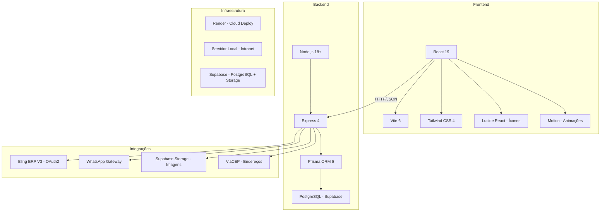
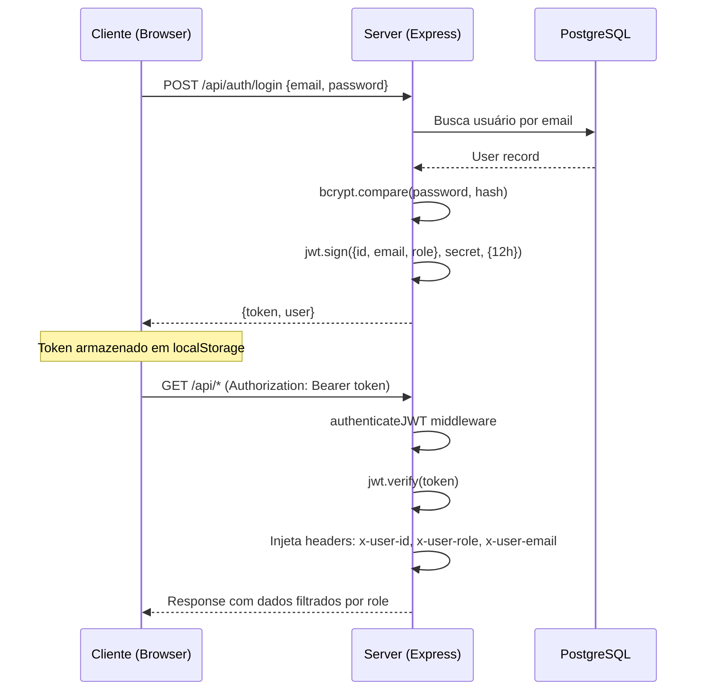
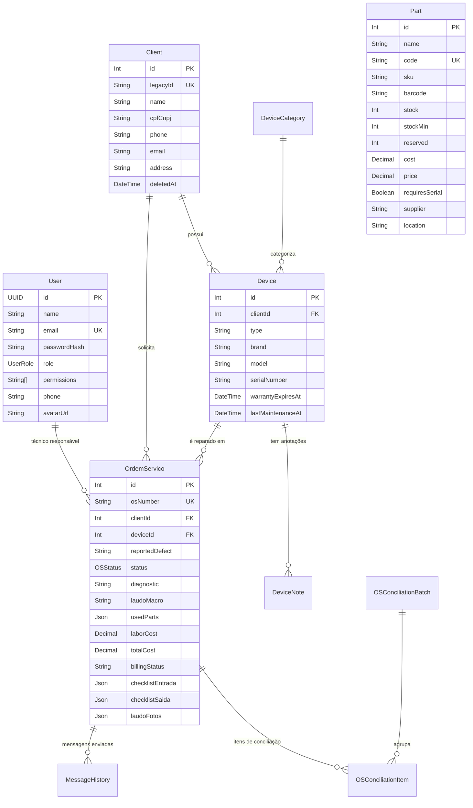
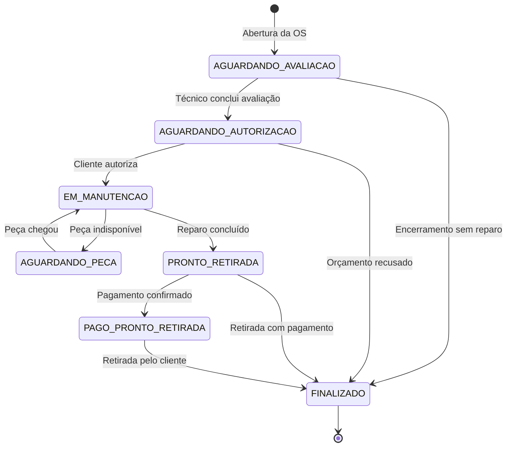
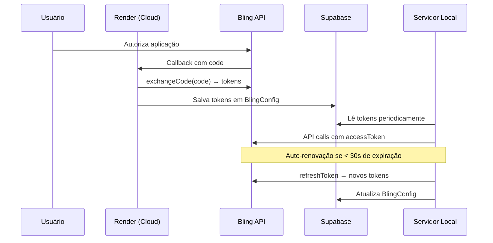
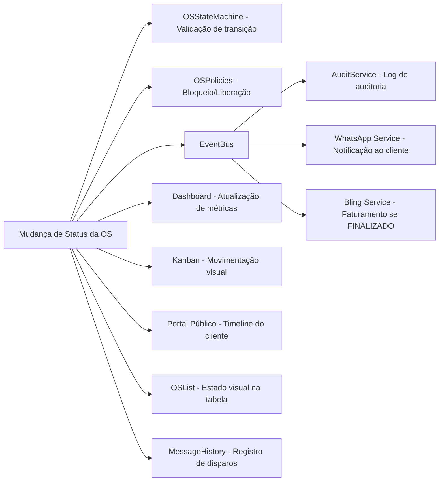
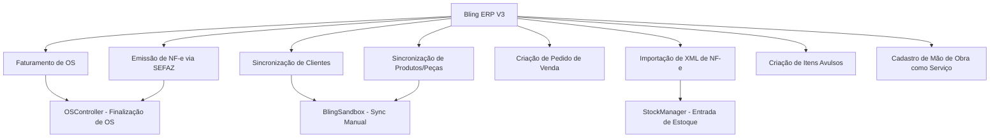
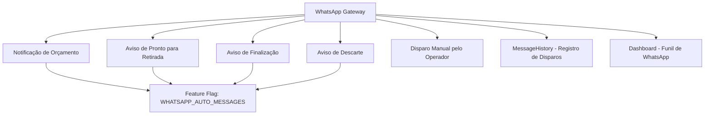
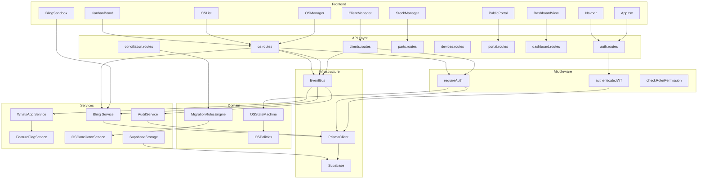

# Base de Conhecimento — MGV Sistema Integrado

> **Versão:** 1.0  
> **Data de Geração:** 18 de Julho de 2026  
> **Finalidade:** Documentação oficial e permanente do projeto. Referência para arquitetos, desenvolvedores e agentes de IA.  
> **Regra:** Este documento reflete exclusivamente o estado atual do sistema. Nenhuma funcionalidade foi inventada ou proposta.

---

## Sumário

1. [Visão Geral do Projeto](#1-visão-geral-do-projeto)
2. [Arquitetura Técnica](#2-arquitetura-técnica)
3. [Modelo de Domínio](#3-modelo-de-domínio)
4. [Fluxo Completo da Ordem de Serviço](#4-fluxo-completo-da-ordem-de-serviço)
5. [Regras de Negócio](#5-regras-de-negócio)
6. [Integrações](#6-integrações)
7. [Estrutura do Projeto](#7-estrutura-do-projeto)
8. [Convenções de Desenvolvimento](#8-convenções-de-desenvolvimento)
9. [Funcionalidades Implementadas](#9-funcionalidades-implementadas)
10. [Funcionalidades em Desenvolvimento](#10-funcionalidades-em-desenvolvimento)
11. [Roadmap](#11-roadmap)
12. [Pontos Técnicos Sensíveis](#12-pontos-técnicos-sensíveis)
13. [Mapa de Dependências](#13-mapa-de-dependências)

---

# 1. Visão Geral do Projeto

## 1.1. Objetivo do Sistema

O **MGV Sistema Integrado** é um sistema web proprietário de **gestão operacional e automação fiscal** desenvolvido especificamente para a assistência técnica **MGV**. Foi projetado para substituir o sistema desktop legado **SH Oficina**, migrando toda a operação para uma plataforma moderna, cloud-first, com integração fiscal direta.

## 1.2. Tipo de Negócio Atendido

Assistência técnica de equipamentos eletrônicos e eletrodomésticos. O sistema gerencia todo o ciclo de vida do atendimento: desde a entrada do aparelho na oficina até a devolução ao cliente, incluindo orçamento, autorização, reparo, faturamento fiscal e controle financeiro.

## 1.3. Problemas que o Sistema Resolve

| Problema | Solução MGV |
|---|---|
| Controle manual de OS em planilhas | Painel Kanban digital com drag-and-drop |
| Emissão manual de NF-e | Faturamento automático via integração Bling/SEFAZ |
| Falta de rastreabilidade de peças | Estoque com reserva lógica e serialização obrigatória |
| Comunicação falha com cliente | Disparos automáticos de WhatsApp por status |
| Sem visibilidade financeira | Dashboard executivo com rentabilidade por OS |
| Dados em sistemas isolados | ERP unificado com sincronização bidirecional |
| Fraude/negligência em teste | Teste de estresse antifraude de 30 minutos em bancada |
| Clientes sem acompanhamento | Portal público de acompanhamento por CPF |

## 1.4. Visão Geral do Fluxo Operacional

```
Cliente chega → Cadastro → Abertura de OS → Checklist de Entrada (fotos)
    → Avaliação Técnica → Orçamento → Autorização do Cliente
    → Manutenção (peças + mão de obra) → Teste de Estresse (30 min)
    → Pronto para Retirada → Faturamento Automático (Bling/SEFAZ)
    → Retirada pelo Cliente → OS Finalizada
```

## 1.5. Objetivos Estratégicos do ERP

- **Digitalização completa** da operação da oficina
- **Compliance fiscal** via integração direta com SEFAZ
- **Rastreabilidade total** de peças, aparelhos e serviços
- **Automação** de comunicação, faturamento e conciliação financeira
- **Inteligência operacional** com dashboards executivos e indicadores de SLA
- **Migração segura** do legado SH Oficina sem perda de dados

---

# 2. Arquitetura Técnica

## 2.1. Stack Tecnológica



### Detalhamento da Stack

| Camada | Tecnologia | Versão | Responsabilidade |
|---|---|---|---|
| **Runtime** | Node.js | 18+ | Ambiente de execução server-side |
| **Framework Web** | Express | 4.21 | API REST, roteamento, middlewares |
| **ORM** | Prisma Client | 6.19 | Mapeamento relacional e queries tipadas |
| **Banco de Dados** | PostgreSQL | Via Supabase | Persistência primária na nuvem |
| **Frontend** | React | 19 | Interface SPA com componentes reativos |
| **Bundler** | Vite | 6.2 | Build e HMR do frontend |
| **CSS** | Tailwind CSS | 4.1 | Estilização utility-first, tema Glassmorphism Dark |
| **Autenticação** | JWT + bcrypt | — | Tokens de sessão de 12h |
| **Imagens** | Sharp | 0.35 | Compressão e redimensionamento de fotos |
| **Planilhas** | xlsx | 0.18 | Leitura de arquivos XLS/CSV legados |
| **PDF** | pdf-parse | 2.4 | Extração de dados de fechamentos de caixa |
| **HTTP Client** | Axios | 1.18 | Comunicação com APIs externas (Bling, WhatsApp) |
| **IA** | Google GenAI | 2.4 | Módulo Isaías (Agente inteligente) |

## 2.2. Arquitetura Monolítica Integrada

O MGV adota uma arquitetura **monolítica com separação lógica clara** entre frontend e backend, ambos residindo no mesmo repositório e servidos pelo mesmo processo Node.js:

```
┌─────────────────────────────────────────────┐
│                 server.ts                    │
│          (Express + Vite Middleware)         │
├─────────────────────────────────────────────┤
│                                             │
│  ┌─── Frontend (React/Vite) ──────────────┐ │
│  │  App.tsx → Componentes → Contextos     │ │
│  │  Roteamento baseado em estado (tabs)   │ │
│  └────────────────────────────────────────┘ │
│                                             │
│  ┌─── Backend (Express API) ──────────────┐ │
│  │  Routes → Middlewares → Controllers    │ │
│  │  Controllers → Services → Domain       │ │
│  │  Domain → Prisma → PostgreSQL          │ │
│  │  EventBus → AuditService               │ │
│  └────────────────────────────────────────┘ │
│                                             │
└─────────────────────────────────────────────┘
```

- **Em desenvolvimento (`npm run dev`):** Vite atua como middleware do Express com HMR.
- **Em produção (`npm start`):** Express serve os arquivos estáticos compilados de `dist/`.

## 2.3. Banco de Dados

### PostgreSQL via Supabase

- **Provider:** Supabase (PostgreSQL gerenciado na nuvem)
- **Conexão:** Obrigatório usar **Connection Pooler IPv4** com flag `?pgbouncer=true` na `DATABASE_URL`
- **ORM:** Prisma Client (tipagem forte, migrations versionadas)
- **Schema:** Arquivo único em [`prisma/schema.prisma`](file:///d:/HD/MGV/MGV_2026/MGV-Assistência-Técnica/prisma/schema.prisma)

### Supabase Storage

- **Uso:** Armazenamento de imagens (avatares de perfil, fotos de laudos)
- **Compressão:** Imagens redimensionadas para 1000px max, com downgrade para JPEG 65% se >800KB
- **Buckets:** Criados automaticamente como públicos caso não existam

## 2.4. Fluxo de Autenticação



**Regras de autenticação:**
- Token JWT válido por **12 horas**
- Primeiro usuário cadastrado pode se registrar livremente
- Cadastros subsequentes exigem token com role `OWNER`
- Senhas legadas em plain-text são convertidas automaticamente para bcrypt no boot
- Rotas públicas (isentas de JWT): `/api/portal`, `/api/auth/login`, `/api/auth/register`, `/api/debug-db`

## 2.5. Sistema de Permissões (RBAC + ACL Granular)

### Hierarquia de Roles

| Role | Nível | Descrição |
|---|---|---|
| `OWNER` | Máximo | Acesso irrestrito, visão financeira, gestão de usuários |
| `ADMIN` | Alto | Administração operacional completa |
| `SUPERVISOR` | Médio-Alto | Supervisão de técnicos e processos |
| `EDITOR` | Médio (Padrão) | Operação padrão do sistema |
| `ATTENDANT` | Médio-Baixo | Atendimento e recepção |
| `TECHNICIAN` | Operacional | Manutenção e laudos técnicos |
| `FINANCIAL` | Específico | Módulo financeiro e conciliação |

### Permissões Granulares (ACL)

Além dos papéis, o sistema possui **permissões granulares** por usuário e por role:
- Tabela `RolePermission`: permissões padrão atreladas ao grupo
- Campo `User.permissions[]`: permissões extras individuais
- A checagem mescla ambas as listas e verifica se todas as flags exigidas estão presentes
- **OWNER sempre tem passe livre** — bypass de todas as checagens

**Arquivo responsável:** [`src/middlewares/auth.ts`](file:///d:/HD/MGV/MGV_2026/MGV-Assistência-Técnica/src/middlewares/auth.ts)

## 2.6. Comunicação entre Módulos

### EventBus (Mensageria Interna)

O sistema utiliza um `EventBus` nativo baseado em `EventEmitter` do Node.js, definido em [`src/events/index.ts`](file:///d:/HD/MGV/MGV_2026/MGV-Assistência-Técnica/src/events/index.ts).

```
Controller dispara evento → EventBus propaga → Listeners reagem assíncronamente
                                                    ├── AuditService (log)
                                                    ├── WhatsApp (notificação)
                                                    └── Bling (sync)
```

Contrato base dos eventos (`StandardEvent`):
- `aggregateId`: ID da entidade afetada
- `aggregateType`: Tipo da entidade (ex: `OrdemServico`, `Client`)
- `actor`: Usuário que disparou a ação
- `version`: Versionamento do evento

## 2.7. Infraestrutura de Deploy

### Render (Cloud)

- **Arquivo:** [`render.yaml`](file:///d:/HD/MGV/MGV_2026/MGV-Assistência-Técnica/render.yaml)
- **Tipo:** Web Service
- **Build:** `npm install && npm run build`
- **Start:** `node dist/server.cjs`
- **Health Check:** `GET /api/integration/bling/status`
- **Variáveis de Produção:** `NODE_ENV`, `DATABASE_URL`, `BLING_CLIENT_ID`, `BLING_CLIENT_SECRET`, `JWT_SECRET`

### Servidor Local (Intranet)

- Porta padrão: `3000`
- Firewall: Regra de entrada TCP na porta 3000
- Execução em background via `iniciar_oculto.vbs` + atalho no `shell:startup`
- Acesso na rede: `http://[IP-DO-SERVIDOR]:3000`

### Fluxo OAuth Híbrido (Local ↔ Cloud)

O callback do Bling retorna para a URL de produção (Render), que salva tokens na tabela `BlingConfig` do Supabase. O servidor local lê e renova esses tokens em background de forma transparente, sem necessidade de logins locais.

## 2.8. Backup Automático

- **Boot backup:** 1 minuto após inicialização do servidor
- **Rotina semanal:** A cada 7 dias, backup recorrente
- **Formato:** JSON exportado para a pasta [`backups/`](file:///d:/HD/MGV/MGV_2026/MGV-Assistência-Técnica/backups)
- **Implementação:** Função `startWeeklyBackupRoutine` em [`server.ts`](file:///d:/HD/MGV/MGV_2026/MGV-Assistência-Técnica/server.ts)

---

# 3. Modelo de Domínio

## 3.1. Diagrama Entidade-Relacionamento



## 3.2. Entidades Detalhadas

### 3.2.1. User (Usuários)

| Aspecto | Detalhe |
|---|---|
| **Finalidade** | Gerenciar acesso, papéis e permissões dos operadores do sistema |
| **Tabela** | `users` |
| **Arquivo Prisma** | [`prisma/schema.prisma`](file:///d:/HD/MGV/MGV_2026/MGV-Assistência-Técnica/prisma/schema.prisma) |
| **Campos Chave** | `id` (UUID), `email` (Unique), `passwordHash`, `role` (UserRole enum), `permissions` (String[]), `avatarUrl` |
| **Relacionamentos** | Nenhum FK direta, mas referenciado logicamente por `x-user-id` nos headers |
| **Regras** | Papel padrão é `EDITOR`. Array `permissions` permite granularidade além do role base. Avatar armazenado no Supabase Storage |

### 3.2.2. Client (Clientes)

| Aspecto | Detalhe |
|---|---|
| **Finalidade** | Cadastro de clientes (PF ou PJ) da assistência técnica |
| **Tabela** | `clients` |
| **Campos Chave** | `legacyId` (Unique — ID do SH Oficina), `cpfCnpj`, `phone`, `address`, `deletedAt` |
| **Relacionamentos** | 1:N → `Device`, 1:N → `OrdemServico` |
| **Regras** | Soft delete via `deletedAt`. CPF/CNPJ normalizado (regex remove máscara) para checagem de duplicidade. Cascade no soft delete: marca `deletedAt` em todos os `Device` e `OrdemServico` do cliente |
| **Eventos** | `CLIENT_CREATED`, `CLIENT_UPDATED` → AuditService |

### 3.2.3. Device (Aparelhos/Equipamentos)

| Aspecto | Detalhe |
|---|---|
| **Finalidade** | Equipamentos trazidos pelos clientes para reparo |
| **Tabela** | `devices` |
| **Campos Chave** | `type`, `brand`, `model`, `serialNumber` (default "Sem Série"), `warrantyExpiresAt`, `lastMaintenanceAt`, `acquisitionDate` |
| **Relacionamentos** | N:1 → `Client` (Cascade delete), 1:N → `OrdemServico`, 1:N → `DeviceNote` |
| **Regras** | Aparelhos com dados incompletos ("Indefinido" ou vazio em marca/modelo/serial) bloqueiam a adição de peças à OS associada (código de bloqueio `DEVICE_INCOMPLETE`) |
| **Eventos** | `DEVICE_CREATED`, `DEVICE_UPDATED` |

### 3.2.4. Part (Peças de Estoque)

| Aspecto | Detalhe |
|---|---|
| **Finalidade** | Cadastro de peças de reposição e controle de estoque |
| **Tabela** | `parts` |
| **Campos Chave** | `code` (Unique — SKU), `stock`, `stockMin`, `reserved`, `cost`, `price`, `requiresSerial`, `supplier`, `location`, `notaFiscalEntradaId` |
| **Relacionamentos** | Referenciada via JSON em `OrdemServico.usedParts` |
| **Regras** | `requiresSerial = true` obriga o preenchimento de número de série na OS antes de finalizar. Estoque decrementado ao editar OS, incrementado no rollback. Alerta quando `stock <= stockMin` (evento `PART_STOCK_LOW`) |

### 3.2.5. OrdemServico (Ordem de Serviço)

| Aspecto | Detalhe |
|---|---|
| **Finalidade** | Coração do sistema. Controla todo o ciclo de vida do atendimento |
| **Tabela** | `ordem_servicos` |
| **Campos Chave** | `osNumber` (Unique, formato `OS-XXXX`), `reportedDefect`, `status` (OSStatus enum), `diagnostic`, `laudoMacro`, `usedParts` (Json), `laborCost`, `totalCost`, `billingStatus`, `checklistEntrada` (Json), `checklistSaida` (Json), `laudoFotos` (Json) |
| **Relacionamentos** | N:1 → `Client`, N:1 → `Device`, 1:N → `MessageHistory`, 1:N → `OSConciliationItem` |
| **Campos Virtuais (Runtime)** | `profitValue`, `profitMarginPercent`, `hasZeroCostParts`, `recurrentAlert` (mesmo aparelho 3+ vezes em 90 dias) |
| **Regras** | Estruturas complexas (peças, checklist, fotos) são desnormalizadas como JSON. Dados de rentabilidade ocultados para não-OWNER. Estado controlado por máquina de estados |

### 3.2.6. BlingConfig (Configuração Bling)

| Aspecto | Detalhe |
|---|---|
| **Finalidade** | Armazenar credenciais OAuth2 e tokens do ERP Bling |
| **Tabela** | `bling_config` |
| **Campos Chave** | `accessToken`, `refreshToken`, `expiresAt` |
| **Regras** | Token renovado automaticamente se estiver a 30s de expirar. Callback OAuth retorna pela URL de produção (Render) que salva tokens no Supabase |

### 3.2.7. FeatureFlag (Feature Flags)

| Aspecto | Detalhe |
|---|---|
| **Finalidade** | Habilitação e desabilitação dinâmica de funcionalidades (Skill Tree) |
| **Tabela** | `feature_flags` |
| **Campos Chave** | `key` (Unique), `enabled` (Boolean) |
| **Flags Conhecidas** | `CLIENT_360_AND_BASE_INSTALADA`, `FISCAL_NFE_EMISSION`, `WHATSAPP_AUTO_MESSAGES`, `OS_PROFITABILITY_CALC` |
| **Cache** | Mapa em memória com TTL de 30 segundos. Não joga erro se DB cair — preserva cache antigo |

### 3.2.8. MessageHistory (Histórico de Mensagens)

| Aspecto | Detalhe |
|---|---|
| **Finalidade** | Registrar todas as mensagens WhatsApp/SMS enviadas |
| **Tabela** | `message_histories` |
| **Relacionamentos** | N:1 → `OrdemServico` (Cascade delete) |
| **Campos Chave** | `channel`, `status` (SENT/DELIVERED/FAILED), `templateKey`, `content` |

### 3.2.9. AuditLog (Trilha de Auditoria)

| Aspecto | Detalhe |
|---|---|
| **Finalidade** | Registro auditável de todas as ações do sistema |
| **Tabela** | `audit_logs` |
| **Campos Chave** | `action`, `entityType`, `entityId`, `oldValue` (Json), `newValue` (Json), `userId`, `timestamp` |
| **Regras** | Polimórfico — registra qualquer entidade. Diff inteligente: só grava se houve mudança real. Fire-and-forget: exceções nunca derrubam o sistema |

### 3.2.10. DeviceNote (Notas de Aparelho)

| Aspecto | Detalhe |
|---|---|
| **Finalidade** | Histórico evolutivo de anotações do equipamento |
| **Tabela** | `device_notes` |
| **Relacionamentos** | N:1 → `Device` |
| **Regras** | Timeline cronológica descendente. Restrito a técnicos e gestão |

### 3.2.11. DeviceCategory (Categorias de Aparelhos)

| Aspecto | Detalhe |
|---|---|
| **Finalidade** | Templates de checklist por categoria (ex: Notebook, Geladeira) |
| **Tabela** | `device_categories` |
| **Campos Chave** | `name`, `defaultChecklist` (Json) |

### 3.2.12. OfficeSetting (Configurações da Oficina)

| Aspecto | Detalhe |
|---|---|
| **Finalidade** | Configurações gerais parametrizáveis por categoria |
| **Tabela** | `office_settings` |
| **Campos Chave** | `category` (GERAL, FINANCEIRO, KANBAN, etc.), `key`, `value` |

### 3.2.13. RolePermission (Permissões por Grupo)

| Aspecto | Detalhe |
|---|---|
| **Finalidade** | ACL granular: mapeamento M:N de role → permissões |
| **Tabela** | `role_permissions` |
| **Regras** | Atualização via transação atômica: destroi antigas e insere novas |

### 3.2.14. OSConciliationBatch / OSConciliationItem

| Aspecto | Detalhe |
|---|---|
| **Finalidade** | Registro de lotes e resultados de conciliação financeira automatizada |
| **Regras** | Suporta rollback por lote. Cada item registra status anterior, novo status e motivo |

## 3.3. Enums

### UserRole
```
OWNER | ADMIN | SUPERVISOR | EDITOR | ATTENDANT | TECHNICIAN | FINANCIAL
```

### OSStatus
```
ORCAMENTO | AGUARDANDO_AVALIACAO | AGUARDANDO_AUTORIZACAO | AGUARDANDO_PECA
EM_MANUTENCAO | PRONTO_RETIRADA | PAGO_PRONTO_RETIRADA | FINALIZADO
```

### OSClosingReason
```
REPARO_CONCLUIDO | ORCAMENTO_RECUSADO | DESCARTE_CLIENTE_RETIRA | DESCARTE_OFICINA
```

---

# 4. Fluxo Completo da Ordem de Serviço

## 4.1. Diagrama da Máquina de Estados



**Arquivo responsável:** [`src/domain/os/os.state-machine.ts`](file:///d:/HD/MGV/MGV_2026/MGV-Assistência-Técnica/src/domain/os/os.state-machine.ts)

## 4.2. Etapas Detalhadas

### 4.2.1. Criação (Abertura)

1. Atendente seleciona ou cadastra o **cliente**
2. Seleciona ou cadastra o **aparelho** do cliente
3. Registra o **defeito relatado** pelo cliente
4. Executa o **checklist de entrada** com fotos (até 6 fotos, comprimidas para 800px via Sharp)
5. Sistema gera número sequencial `OS-XXXX`
6. OS entra automaticamente no status `AGUARDANDO_AVALIACAO`
7. Recibo de entrada pode ser impresso

**Endpoint:** `POST /api/ordens-servico`  
**Arquivo:** [`src/routes/os.routes.ts`](file:///d:/HD/MGV/MGV_2026/MGV-Assistência-Técnica/src/routes/os.routes.ts)

### 4.2.2. Avaliação Técnica

1. Técnico examina o aparelho em bancada
2. Preenche o **diagnóstico técnico** detalhado
3. Identifica **peças necessárias** e **mão de obra**
4. Calcula o **orçamento** (`totalCost = soma peças + laborCost`)
5. Preenche o **laudo macro** (resumo para o cliente)
6. Pode anexar **fotos do laudo**
7. Ao concluir → transição para `AGUARDANDO_AUTORIZACAO`

**Regras de bloqueio:**
- Se o orçamento estiver zerado (`totalCost === 0`) e houver peças, o WhatsApp de orçamento não é enviado
- Se o aparelho estiver com dados incompletos, a adição de peças é bloqueada (`DEVICE_INCOMPLETE`)

### 4.2.3. Autorização do Cliente

1. Cliente recebe orçamento via **WhatsApp automático** ou consulta no **Portal Público**
2. **Via Portal:** Cliente aprova diretamente, e o sistema registra o IP como termo de aceite digital
3. **Via Atendente:** Operador registra a decisão do cliente
4. Se autorizado → `EM_MANUTENCAO`
5. Se recusado → `FINALIZADO` com `OSClosingReason.ORCAMENTO_RECUSADO`

**Endpoint Portal:** `POST /api/portal/os/approve`

### 4.2.4. Manutenção

1. Técnico executa o reparo
2. Registra peças efetivamente utilizadas (com `costSnapshot` congelado)
3. **Serialização obrigatória**: Se a peça tem `requiresSerial = true`, o número de série DEVE ser preenchido
4. **Estoque**: Peças são decrementadas do estoque global ao serem adicionadas à OS
5. Ao concluir → `PRONTO_RETIRADA`

**Regras de estoque:**
- Ao editar peças da OS, as peças anteriores são devolvidas ao estoque e as novas são subtraídas
- Se estoque insuficiente → HTTP 400

### 4.2.5. Aguardando Peça

1. Peça necessária não disponível em estoque
2. OS fica em espera até a peça chegar
3. Quando a peça chega → volta para `EM_MANUTENCAO`

### 4.2.6. Pronto para Retirada

1. Reparo concluído, aparelho pronto
2. **Teste de Estresse**: Exige teste físico de **30 minutos** em bancada antes de liberar (configurável para 10s em dev via `ALLOW_SHORT_STRESS_TEST=true`)
3. Cliente é notificado via WhatsApp
4. Aguarda pagamento e/ou retirada

### 4.2.7. Pago, Pronto para Retirada

1. Pagamento confirmado antes da retirada física
2. Aguarda apenas a retirada do aparelho

### 4.2.8. Finalização

1. Cliente retira o aparelho
2. **Faturamento automático via Bling** é disparado:
   - Cria Pedido de Venda no Bling
   - Emite NF-e via SEFAZ
   - `billingStatus` → `PROCESSANDO` → `FATURADO` (ou `REJEITADO`)
3. Se encerramento sem reparo → `billingStatus` = `DISPENSADO`
4. OS marcada como `FINALIZADO`

### 4.2.9. Encerramento sem Reparo

Cenários possíveis (via `OSClosingReason`):
- `ORCAMENTO_RECUSADO`: Cliente recusou o orçamento
- `DESCARTE_CLIENTE_RETIRA`: Cliente desiste e retira o aparelho sem reparo
- `DESCARTE_OFICINA`: Cliente autoriza descarte ambiental do aparelho pela oficina

### 4.2.10. Regras de Transição (Policies)

Antes de permitir a finalização, o sistema executa [`OSPolicies.canFinishOS()`](file:///d:/HD/MGV/MGV_2026/MGV-Assistência-Técnica/src/domain/os/os.policies.ts):

1. **Serialização**: Verifica se todas as peças com `requiresSerial = true` possuem número de série preenchido
2. **Diagnóstico**: Verifica se o campo diagnóstico está preenchido
3. **Valor**: Verifica se `totalCost > 0` em reparos normais (evita faturamento zerado)
4. Se qualquer validação falhar → HTTP 400 com mensagem especificando qual peça falta o serial

---

# 5. Regras de Negócio

## 5.1. Serialização Obrigatória

- Peças com `requiresSerial = true` exigem número de série ao serem aplicadas em uma OS
- Bloqueio hard: a OS **não pode ser finalizada** sem todos os seriais preenchidos
- Usada para peças de alto valor (ex: placas, telas, baterias)
- Na conciliação legada, seriais automáticos `MIG-AUTO-OSNumber-XXX` podem ser forçados via flag `forceSerialFix`

**Arquivo:** [`src/domain/os/os.policies.ts`](file:///d:/HD/MGV/MGV_2026/MGV-Assistência-Técnica/src/domain/os/os.policies.ts)

## 5.2. Cálculo de Rentabilidade

- Rentabilidade calculada por OS: `profitValue = totalCost - (soma costSnapshot das peças)`
- `profitMarginPercent = (profitValue / totalCost) * 100`
- `costSnapshot` é congelado no momento da inserção da peça na OS (evita flutuação futura)
- **Visibilidade restrita**: Apenas role `OWNER` E feature flag `OS_PROFITABILITY_CALC` ativa
- Dados de custo (`costSnapshot`) são **deletados da resposta** da API para não-OWNER
- `hasZeroCostParts`: Alerta quando existem peças sem custo registrado ("Falso Lucro")
- Na migração legada, se não houver `costSnapshot`, sistema assume **50% do preço** como custo estimado

**Arquivo:** [`src/routes/os.routes.ts`](file:///d:/HD/MGV/MGV_2026/MGV-Assistência-Técnica/src/routes/os.routes.ts) (filtro de resposta)

## 5.3. Permissões e RBAC

- 7 roles hierárquicos: `OWNER > ADMIN > SUPERVISOR > EDITOR > ATTENDANT > TECHNICIAN > FINANCIAL`
- OWNER tem bypass total em todas as verificações
- Permissões granulares por usuário (`User.permissions[]`) + por role (`RolePermission`)
- Checagem unificada: mescla permissões individuais + do grupo
- Funções de controle de acesso utilizadas: `requireAuth`, `checkRole`, `checkPermission`
- Exemplos de permissões: `can_view_clients`, `can_view_inventory`, `can_edit_os`, `can_view_financial`

**Arquivo:** [`src/middlewares/auth.ts`](file:///d:/HD/MGV/MGV_2026/MGV-Assistência-Técnica/src/middlewares/auth.ts)

## 5.4. Base Instalada e Recorrência

- Rastreabilidade vitalícia de cada aparelho: histórico de todas as OSs, notas e garantias
- **Alerta de Recorrência (`recurrentAlert`)**: Ativado quando o mesmo `deviceId` aparece em 3+ OSs nos últimos 90 dias
- Prontuário do aparelho acessível via `GET /api/devices/:id/prontuario`
- Prontuário 360° do cliente via `GET /api/clients/:id/360`
- Campo `totalSpent`: soma de todas as OSs finalizadas do cliente
- Feature flag: `CLIENT_360_AND_BASE_INSTALADA`

## 5.5. Lazy Loading e Paginação

- Listagens de clientes e peças usam query param `limit` (padrão 100, ou `all`)
- OSList carrega detalhes por OS sob demanda (modal de prontuário)
- Feature Flags cacheadas em memória com TTL de 30s

## 5.6. Checklists

- **Checklist de Entrada**: Executado na abertura da OS. Itens com status `OK`, `AVARIA` ou `NA`
- **Checklist de Saída**: Executado antes da entrega ao cliente
- Templates de checklist definidos por `DeviceCategory.defaultChecklist`
- Armazenados como JSON desnormalizado na OS
- Fotos do laudo: até 6 fotos em Base64, comprimidas para 800px max

## 5.7. Portal Público do Cliente

- Acesso via `GET /api/portal/os` com número da OS + CPF/CNPJ
- **Validação dupla**: Extrai apenas dígitos do CPF para checar contra o cliente da OS
- **Transformação de status**: Status internos são convertidos em steps amigáveis com cores e timeline
- **Mascara informações internas**: Apresenta apenas `laudoMacro`, oculta diagnóstico técnico e anotações
- **Aprovação remota**: Cliente aprova orçamento com IP registrado como aceite digital
- Rota pública (isenta de JWT)

**Arquivo:** [`src/routes/portal.routes.ts`](file:///d:/HD/MGV/MGV_2026/MGV-Assistência-Técnica/src/routes/portal.routes.ts)

## 5.8. Disparos Automáticos (WhatsApp)

- Condicionados à feature flag `WHATSAPP_AUTO_MESSAGES`
- Templates interpolados por status: `{cliente_nome}`, `{os_numero}`, etc.
- Disparo bloqueado se: diagnóstico vazio OU totalCost = 0
- Templates específicos para: `AGUARDANDO_AVALIACAO`, `PRONTO_RETIRADA`, `FINALIZADO`, `DESCARTE`
- Delay de 1.5s antes do POST real
- Registrados na tabela `MessageHistory`
- **Modo Simulação**: Se `WHATSAPP_API_URL` não configurada → log no console, marca como entregue

## 5.9. Auditoria

- Sistema unificado de trilha de auditoria
- Eventos consumidos: `CLIENT_CREATED`, `CLIENT_UPDATED`, `OS_CONCILIATED`, `OS_STATUS_CHANGED`
- **Diff inteligente**: Compara `oldValue` vs `newValue`, só registra se houve mudança real
- **Fire-and-forget**: Operação assíncrona, exceções nunca derrubam a aplicação
- Registros na tabela `AuditLog` com `userId`, `timestamp`, `entityType`, `action`

**Arquivo:** [`src/services/AuditService.ts`](file:///d:/HD/MGV/MGV_2026/MGV-Assistência-Técnica/src/services/AuditService.ts)

## 5.10. Conciliação Financeira

- Motor de regras cognitivas em [`src/domain/os/MigrationRulesEngine.ts`](file:///d:/HD/MGV/MGV_2026/MGV-Assistência-Técnica/src/domain/os/MigrationRulesEngine.ts)
- Processa PDFs de fechamento de caixa + planilhas de pagamento via [`src/services/OSConciliatorService.ts`](file:///d:/HD/MGV/MGV_2026/MGV-Assistência-Técnica/src/services/OSConciliatorService.ts)
- **Heurísticas de match:**
  1. **Match por Número da OS** — score alto
  2. **Match por Nome do Cliente** — score com penalidade
  3. **Presença Física** — Regra Soberana (se aparelho está na prateleira → elevação de status)
  4. **Cronologia** — Janela viável de -2 a +90 dias do pagamento
  5. **Ambiguidade** — Reduz confiança se múltiplas OSs abertas do mesmo cliente
  6. **Qualidade do Serviço** — Bônus se laudo completo com fotos e WhatsApp enviado
- **Saída**: Sugestão de novo status + nível de confiança (`HIGH`, `MEDIUM`, `LOW`) + motivo
- Suporta **rollback** por lote
- Cache de arquivos processados via `conciliation_cache.json` (hash por mtime + size)

## 5.11. Estoque

- Reserva lógica na orçamentação, baixa efetiva na edição da OS
- Ao editar peças da OS: peças anteriores devolvidas, novas subtraídas
- Importação de XML de NF-e de entrada via endpoint Bling
- Alertas de estoque crítico quando `stock <= stockMin` (evento `PART_STOCK_LOW`)
- Dashboard operacional exibe peças com estoque abaixo do mínimo

## 5.12. Teste de Estresse Antifraude

- Teste físico obrigatório de **30 minutos** antes de finalizar a OS
- Evita que técnico finalize sem testar adequadamente
- Configurável: `ALLOW_SHORT_STRESS_TEST=true` no `.env` reduz para 10 segundos (apenas desenvolvimento)

## 5.13. Aparelho Incompleto

- Se o aparelho não tem marca, modelo ou serial preenchidos ("Indefinido", vazio, "Sem Série")
- Bloqueio de adição de peças à OS → código de erro `DEVICE_INCOMPLETE`
- Garante integridade dos dados de rastreabilidade

---

# 6. Integrações

## 6.1. Bling ERP V3

### 6.1.1. Visão Geral

O Bling é o ERP fiscal integrado via API REST V3 com autenticação OAuth2. A integração cobre sincronização de clientes, produtos, faturamento e emissão de NF-e via SEFAZ.

**Arquivos responsáveis:**
- [`src/services/bling.ts`](file:///d:/HD/MGV/MGV_2026/MGV-Assistência-Técnica/src/services/bling.ts) — Core OAuth e sincronização cadastral
- [`src/services/osToBling.ts`](file:///d:/HD/MGV/MGV_2026/MGV-Assistência-Técnica/src/services/osToBling.ts) — Faturamento de OS

### 6.1.2. OAuth2



### 6.1.3. Sincronização de Clientes

- Função: `syncClientToBling(client)`
- **Higienização de endereço**: Regex pesado para extrair logradouro, número, bairro, CEP, município e UF de uma string única
- **Definição fiscal**: Detecta PF vs PJ automaticamente pelo tamanho do CPF/CNPJ
- **Rate Limiting**: Exponential backoff em caso de HTTP 429 (multiplica delay em 1.5x)

### 6.1.4. Sincronização de Produtos/Peças

- Função: `syncPartToBling(part)`
- Sincroniza itens do estoque local como produtos no Bling
- Suporta consulta reversa: `fetchProductFromBling(code)`

### 6.1.5. Faturamento de OS

- Função: `sendOsToBling(os)`
- **Fluxo:**
  1. Converte peças usadas da OS em itens de Pedido de Venda
  2. Peças avulsas sem cadastro → cria produto genérico `AVULSO-GERAL` ou `AVULSO-CATEGORIA`
  3. Mão de obra → produto `SRV-MAO-DE-OBRA`
  4. Cria Pedido de Venda no Bling
  5. Emite NF-e via SEFAZ
- **Tolerância a falhas**: Se Pedido de Venda criado com sucesso mas NF-e recusada pela SEFAZ, não faz rollback — retorna sucesso parcial com alerta
- **Status de billing**: `PENDENTE` → `PROCESSANDO` → `FATURADO` | `REJEITADO` | `DISPENSADO`

### 6.1.6. Limitações Conhecidas

- Dependência do callback via Render (cloud) para OAuth
- Rate limit da API Bling pode causar lentidão em sincronizações massivas
- Produtos avulsos criados sob demanda podem acumular itens genéricos no Bling
- NF-e rejeitada pela SEFAZ não tem retry automático
- Sincronização é unidirecional para clientes/peças (MGV → Bling)

## 6.2. WhatsApp

### 6.2.1. Visão Geral

Comunicação transacional automática com clientes via API de Gateway de WhatsApp.

**Arquivo:** [`src/services/whatsapp.ts`](file:///d:/HD/MGV/MGV_2026/MGV-Assistência-Técnica/src/services/whatsapp.ts)

### 6.2.2. Eventos e Templates

| Status da OS | Template | Variáveis |
|---|---|---|
| `AGUARDANDO_AVALIACAO` | Orçamento enviado | `{cliente_nome}`, `{os_numero}`, valor |
| `PRONTO_RETIRADA` | Aparelho pronto | `{cliente_nome}`, `{os_numero}` |
| `FINALIZADO` | OS encerrada | `{cliente_nome}`, `{os_numero}` |
| Descarte | Descarte ambiental | `{cliente_nome}`, `{os_numero}` |

### 6.2.3. Regras

- **Feature flag**: `WHATSAPP_AUTO_MESSAGES` controla ativação global
- **Proteção**: Não envia se diagnóstico vazio ou `totalCost === 0`
- **Delay**: 1.500ms antes do POST real
- **Modo Simulação**: Sem `WHATSAPP_API_URL` → console log + marca como entregue
- **Histórico**: Todos os disparos registrados em `MessageHistory`
- **Dashboard**: Contagem de enviados/falhados no painel operacional

### 6.2.4. Disparos Manuais

Endpoint dedicado para reenvio manual de mensagem por operadores:
- **Controller:** WhatsAppController
- POST com dados customizados (número, conteúdo)
- Mesma lógica de envio real ou simulado

## 6.3. Portal Público

### 6.3.1. Funcionamento

- URL pública acessível sem autenticação: `/acompanhar`
- Cliente informa: número da OS + CPF/CNPJ
- Backend valida e retorna dados sanitizados

### 6.3.2. Informações Exibidas

- **Timeline sintética**: Steps visuais com cores e horários calculados
- **Status amigável**: Tradução de status técnicos para linguagem do cliente
- **Laudo macro**: Resumo do diagnóstico (oculta detalhes internos)
- **Orçamento**: Valor total quando aplicável

### 6.3.3. Informações Ocultas

- Diagnóstico técnico detalhado
- Anotações internas
- Dados de custo e rentabilidade
- Informações de estoque

### 6.3.4. Aprovação Remota

- Cliente aprova orçamento clicando em "Aprovar"
- Transição: `AGUARDANDO_AUTORIZACAO` → `EM_MANUTENCAO`
- IP do cliente registrado como **termo de aceite digital** no laudo

**Arquivo:** [`src/routes/portal.routes.ts`](file:///d:/HD/MGV/MGV_2026/MGV-Assistência-Técnica/src/routes/portal.routes.ts)

## 6.4. Supabase Storage

- Upload de imagens (avatares, laudos) com compressão via Sharp
- Redimensionamento: máximo 1000px
- Se >800KB após otimização → downgrade forçado para JPEG 65%
- Bucket criado automaticamente como público se não existir
- Deleção de artefatos antigos ao atualizar avatar

**Arquivo:** [`src/services/supabaseStorage.ts`](file:///d:/HD/MGV/MGV_2026/MGV-Assistência-Técnica/src/services/supabaseStorage.ts)

## 6.5. ViaCEP

- Consulta de CEP no frontend para auto-preenchimento de endereço
- API: `https://viacep.com.br/ws/{cep}/json`
- Usado no cadastro/edição de clientes (componente `ClientManager`)

---

# 7. Estrutura do Projeto

## 7.1. Mapa de Diretórios

```
MGV-Assistência-Técnica/
├── .agents/                    # Workflows e regras do agente de IA
│   └── workflows/              # System Instructions (MGV Senior Engineer)
├── docs/                       # Documentação oficial do projeto
│   └── design/                 # Mockups UI/UX (Stitch)
├── prisma/                     # Schema e migrations do Prisma ORM
│   └── schema.prisma           # Modelo de dados (14 entidades)
├── src/                        # Código-fonte principal
│   ├── App.tsx                 # Componente raiz, roteamento por estado
│   ├── main.tsx                # Ponto de entrada React
│   ├── index.css               # Estilos globais
│   ├── types.ts                # Interfaces e tipos TypeScript
│   ├── components/             # Componentes React do frontend
│   │   ├── DashboardView.tsx   # Dashboard operacional e executivo
│   │   ├── ClientManager.tsx   # Gestão de clientes e prontuário 360
│   │   ├── OSManager.tsx       # Wizard de criação de OS (4 etapas)
│   │   ├── OSList.tsx          # Listagem analítica de OSs
│   │   ├── KanbanBoard.tsx     # Quadro Kanban drag-and-drop
│   │   ├── StockManager.tsx    # Gestão de estoque e importação XML
│   │   ├── BlingSandbox.tsx    # Painel de integração fiscal
│   │   ├── SettingsView.tsx    # Configurações do sistema
│   │   ├── ProfileSettings.tsx # Perfil do usuário
│   │   ├── PublicPortal.tsx    # Portal público do cliente
│   │   └── Navbar.tsx          # Barra lateral de navegação
│   ├── config/                 # Configurações de negócio
│   │   └── conciliation.config.ts  # Pesos e scores de conciliação
│   ├── contexts/               # Contextos React
│   │   └── FeatureFlagContext.tsx  # Gerenciamento de Feature Flags
│   ├── controllers/            # (Lógica embutida nas routes)
│   ├── database/               # Conexão Prisma
│   │   └── prisma.ts           # Singleton do PrismaClient
│   ├── domain/                 # Regras de negócio puras (DDD)
│   │   └── os/
│   │       ├── os.state-machine.ts     # Máquina de estados da OS
│   │       ├── os.policies.ts          # Políticas de bloqueio/liberação
│   │       └── MigrationRulesEngine.ts # Motor de conciliação
│   ├── events/                 # EventBus (mensageria interna)
│   │   └── index.ts            # EventEmitter + definição de eventos
│   ├── isaias/                 # Módulo de agente inteligente (IA)
│   ├── middlewares/            # Middlewares Express
│   │   └── auth.ts             # JWT, RBAC, ACL granular
│   ├── routes/                 # Definição de rotas da API
│   │   ├── auth.routes.ts      # Login, registro, perfil, gestão de usuários
│   │   ├── clients.routes.ts   # CRUD clientes, prontuário 360
│   │   ├── os.routes.ts        # CRUD OS, status, faturamento
│   │   ├── parts.routes.ts     # CRUD peças de estoque
│   │   ├── devices.routes.ts   # CRUD aparelhos, notas, categorias
│   │   ├── portal.routes.ts    # Portal público do cliente
│   │   ├── dashboard.routes.ts # Dashboards executivo e operacional
│   │   ├── conciliation.routes.ts  # Conciliação financeira
│   │   └── (demais rotas)      # Search, WhatsApp, Permissions
│   └── services/               # Serviços de integração e negócio
│       ├── bling.ts            # Core Bling (OAuth, sync, rate limit)
│       ├── osToBling.ts        # Faturamento OS → Bling
│       ├── whatsapp.ts         # Disparos WhatsApp
│       ├── AuditService.ts     # Trilha de auditoria
│       ├── FeatureFlagService.ts   # Cache de feature flags
│       ├── OSConciliatorService.ts # Processamento de conciliação
│       └── supabaseStorage.ts  # Upload de imagens Supabase
├── scripts/                    # Scripts de automação
│   ├── migrations/             # Pipeline de migração SH Oficina
│   ├── seeds/                  # Dados iniciais e feature flags
│   ├── tests/                  # Smoke tests e homologações
│   ├── utils/                  # Conversores XLS/CSV, limpeza de dados
│   └── maintenance/            # Cleanup, hotfixes, deduplicação
├── backups/                    # Backups JSON automáticos
├── dist/                       # Build de produção compilada
├── server.ts                   # Entrypoint do servidor
├── vite.config.ts              # Configuração Vite
├── tsconfig.json               # Configuração TypeScript
├── render.yaml                 # Deploy Render
└── package.json                # Dependências e scripts NPM
```

## 7.2. Responsabilidade de Cada Diretório

| Diretório | Responsabilidade |
|---|---|
| `src/components/` | Componentes React que compõem as telas do frontend |
| `src/contexts/` | Gerenciamento de estado global React (Feature Flags) |
| `src/controllers/` | Camada de controle (atualmente embutida nas routes) |
| `src/database/` | Instância singleton do PrismaClient |
| `src/domain/` | Regras de negócio puras, sem dependência de framework |
| `src/events/` | EventBus para comunicação desacoplada entre módulos |
| `src/isaias/` | Módulo de agente inteligente (IA com Google GenAI) |
| `src/middlewares/` | Interceptação de requests: autenticação, RBAC, ACL |
| `src/routes/` | Definição de endpoints REST e lógica dos controllers |
| `src/services/` | Serviços de integração externa e lógica de negócio transversal |
| `src/config/` | Configurações de regras de negócio (pesos, scores) |
| `prisma/` | Schema do banco de dados e migrations |
| `scripts/` | Automação: migração legada, seeds, testes, manutenção |
| `backups/` | Snapshots JSON periódicos do banco |
| `docs/` | Documentação oficial e especificações |

---

# 8. Convenções de Desenvolvimento

## 8.1. EventBus (Mensageria Interna)

- Baseado em `EventEmitter` nativo do Node.js
- Contrato `StandardEvent`: `aggregateId`, `aggregateType`, `actor`, `version`
- Listeners são **fire-and-forget**: não bloqueiam o fluxo principal
- Auditoria e notificações são sempre assíncronas

**Eventos definidos:**

| Evento | Trigger | Listeners |
|---|---|---|
| `os.created` | Criação de OS | AuditService |
| `os.status.changed` | Mudança de status | AuditService, WhatsApp |
| `os.finalized` | Fechamento da OS | Bling (faturamento), Estoque |
| `client.created` | Cadastro de cliente | AuditService |
| `client.updated` | Edição de cliente | AuditService |
| `part.stock.low` | Estoque abaixo do mínimo | Dashboard (alerta) |
| `device.created` | Cadastro de aparelho | AuditService |
| `device.updated` | Edição de aparelho | AuditService |
| `os.conciliated` | Conciliação aplicada | AuditService |

## 8.2. Auditoria

- Toda alteração em entidades críticas gera registro em `AuditLog`
- Diff inteligente: compara valores antes/depois, só registra mudanças reais
- Fire-and-forget: nunca bloqueia nem derruba o sistema
- Implementação: Singleton `auditService` que escuta o EventBus

## 8.3. Controllers/Routes

- **Controllers finos**: A lógica dos controllers está embutida nas definições de rotas em `src/routes/`
- **Padrão**: Route → Middleware (auth/role) → Validação → Prisma Query → Evento → Response
- Validações de entrada são feitas inline nos handlers (não há lib de validação)
- Respostas HTTP padronizadas: `200`, `201`, `400`, `401`, `403`, `404`, `409`, `500`

## 8.4. Services

- Regras de integração externa isoladas em `src/services/`
- Cada serviço é **auto-contido** com suas dependências declaradas
- Serviços de infraestrutura (Audit, FeatureFlag) são singletons
- Serviços de integração (Bling, WhatsApp) são funções exportadas

## 8.5. Domain (DDD Lite)

- Regras de negócio puras em `src/domain/`
- Sem dependência de Express, Prisma ou qualquer framework
- Máquina de estados: transições válidas tipadas estaticamente
- Policies: validações de pré-condição para transições críticas
- MigrationRulesEngine: motor cognitivo de conciliação com heurísticas configuráveis

## 8.6. Prisma

- **Schema único** em `prisma/schema.prisma`
- **Migrations**: Via `npx prisma migrate dev/deploy`
- **Client**: Singleton em `src/database/prisma.ts` (evita saturação de conexões)
- **JSON desnormalizado**: Campos complexos (peças, checklists, fotos) armazenados como `Json`
- **Soft delete**: `deletedAt` em Client, Device, Part
- **Cascade**: Configurado para relações críticas (Client → Device, OS → MessageHistory)

## 8.7. Nomenclatura

- **Arquivos**: `kebab-case` para routes e services, `PascalCase` para componentes React
- **Rotas API**: `/api/recurso` com verbos HTTP corretos (GET, POST, PUT, DELETE)
- **Variáveis**: `camelCase` no TypeScript
- **Banco**: `snake_case` para tabelas e colunas (via Prisma `@@map`)
- **Enums**: `SCREAMING_SNAKE_CASE`

## 8.8. Validação e Rollback

- Validações de duplicidade via queries Prisma (email, CPF, código de peça)
- Transações Prisma (`$transaction`) para operações atômicas (ex: permissões por role)
- Rollback de conciliação por lote (`OSConciliationBatch`)
- Estoque: devolução de peças ao editar OS (reverte quantidades anteriores antes de aplicar novas)

## 8.9. Batch Operations

- Sincronização em lote com Bling (catálogo completo de clientes/peças)
- Conciliação em lote (múltiplas OSs processadas de uma vez)
- Migração legada em lote com relatórios de totais (lidos, criados, erros)
- Progress tracking via endpoint `GET /api/integration/bling/sync/catalog/progress`

---

# 9. Funcionalidades Implementadas

## 9.1. Módulo de Autenticação e Usuários

- [x] Login com JWT (12h de validade)
- [x] Registro de usuários com controle OWNER
- [x] Gestão de perfil (nome, email, senha, avatar)
- [x] Upload de avatar para Supabase Storage
- [x] RBAC com 7 roles hierárquicos
- [x] ACL granular por usuário e por grupo (RolePermission)
- [x] Conversão automática de senhas legadas (plain-text → bcrypt)

## 9.2. Módulo de Clientes

- [x] CRUD completo de clientes (com soft delete)
- [x] Validação de CPF/CNPJ duplicado (regex normalizado)
- [x] Busca de CEP via ViaCEP (auto-preenchimento)
- [x] Cadastro cascata de aparelhos na criação do cliente
- [x] Prontuário 360° do cliente (visão completa)
- [x] Campo `totalSpent` (receita acumulada do cliente)
- [x] Eventos de auditoria (criação e edição)

## 9.3. Módulo de Aparelhos (Devices)

- [x] CRUD de aparelhos vinculados a clientes
- [x] Prontuário do aparelho (timeline de OSs)
- [x] Sistema de notas/anotações por aparelho
- [x] Gestão de garantia (data de expiração)
- [x] Categorias com checklists padrão
- [x] Detecção de aparelho incompleto (bloqueio `DEVICE_INCOMPLETE`)

## 9.4. Módulo de Ordens de Serviço

- [x] Wizard de criação em 4 etapas (Cliente → Aparelho → Defeito → Fotos)
- [x] Máquina de estados com transições validadas
- [x] Checklist de entrada com fotos (até 6, comprimidas)
- [x] Gestão de peças usadas com estoque integrado
- [x] Serialização obrigatória para peças de alto valor
- [x] Cálculo de rentabilidade por OS (OWNER only)
- [x] Alerta de recorrência (3+ OSs do mesmo aparelho em 90 dias)
- [x] Impressão de recibo/ticket
- [x] Transições de status com políticas de bloqueio
- [x] Faturamento automático via Bling ao finalizar
- [x] Encerramento sem reparo (4 motivos possíveis)
- [x] Items avulsos (peças/serviços não cadastrados)

## 9.5. Módulo Kanban

- [x] Painel Kanban com colunas por status
- [x] Drag-and-drop (via Dnd-Kit) com atualização otimista
- [x] Visualização rápida de pendências e gargalos

## 9.6. Módulo de Estoque

- [x] CRUD completo de peças
- [x] Controle de estoque (quantidade, mínimo, reserva)
- [x] Alerta de estoque crítico (`stock <= stockMin`)
- [x] Flag `requiresSerial` por peça
- [x] Campos logísticos (fornecedor, localização)
- [x] Importação de XML de NF-e de entrada

## 9.7. Módulo Dashboard

- [x] Dashboard Operacional (técnicos): quantidades por status, peças críticas, TMA, SLA (>15 dias)
- [x] Dashboard Executivo (OWNER): receita, custos, lucro, ticket médio do mês
- [x] Contagem global do funil de WhatsApp (enviados/falhados)

## 9.8. Módulo de Integração Bling

- [x] OAuth2 com auto-renovação de tokens
- [x] Sincronização de clientes (MGV → Bling)
- [x] Sincronização de produtos/peças (MGV → Bling)
- [x] Criação de Pedido de Venda
- [x] Emissão de NF-e via SEFAZ
- [x] Tratamento de peças avulsas e mão de obra
- [x] Rate limiting com exponential backoff
- [x] Painel de monitoramento (BlingSandbox) com logs de falha

## 9.9. Módulo WhatsApp

- [x] Disparos automáticos por mudança de status
- [x] Templates interpolados
- [x] Modo simulação (sem API configurada)
- [x] Histórico de mensagens por OS
- [x] Disparos manuais via interface

## 9.10. Módulo Portal Público

- [x] Consulta de OS por número + CPF
- [x] Timeline visual de status
- [x] Aprovação remota de orçamento com registro de IP

## 9.11. Módulo de Auditoria

- [x] Trilha de auditoria automatizada via EventBus
- [x] Diff inteligente de alterações
- [x] Operação fail-safe (fire-and-forget)

## 9.12. Módulo de Feature Flags

- [x] CRUD de flags via API
- [x] Cache em memória com TTL de 30s
- [x] Integração frontend via `FeatureFlagContext`
- [x] Resiliência a falhas de banco

## 9.13. Módulo de Busca

- [x] Busca Omnibox unificada (clientes, OSs, peças, aparelhos)
- [x] Regex insensitive para filtragem
- [x] Filtragem por permissões (RBAC)
- [x] Limite de 5 resultados por bloco

## 9.14. Infraestrutura

- [x] Backup automático (boot + semanal)
- [x] Deploy contínuo via Render
- [x] Servidor local para intranet
- [x] Execução em background (VBS)
- [x] Compressão de imagens (Sharp)

---

# 10. Funcionalidades em Desenvolvimento

## 10.1. Central de Status (Avaliação em Lote)

- Scan automático de OSs paradas em avaliação
- Elevação em lote para `AGUARDANDO_AUTORIZACAO`
- Disparo integrado de WhatsApp em background
- **Endpoints existentes:** `GET /api/conciliacao/avaliacao-scan`, `POST /api/conciliacao/avaliacao-apply`
- **Estado:** Parcialmente implementado, endpoints funcionais

## 10.2. Conciliação Financeira Automatizada

- Motor de regras cognitivas operacional
- Processamento de PDFs e planilhas funcional
- Cache de arquivos processados implementado
- **Pendências:** Refinamento de heurísticas, calibração de pesos, UI dedicada
- **Estado:** Funcional no backend, interface em evolução

## 10.3. Importação XLS/CSV

- Scripts de migração legada funcional para clientes
- Leitura de planilhas do SH Oficina implementada
- **Pendências:** Interface de upload no frontend, validação visual pré-importação
- **Estado:** Funcional via scripts CLI

## 10.4. Módulo Isaías (Agente Inteligente)

- Diretório `src/isaias/` presente
- Integração com Google GenAI (`@google/genai`)
- **Estado:** Em desenvolvimento inicial

## 10.5. Emissão de NFe via XML

- Importação de XML de notas fiscais de entrada de estoque
- Feature flag: `FISCAL_NFE_EMISSION`
- **Estado:** Parcialmente implementado no `StockManager`

---

# 11. Roadmap

## 11.1. Concluído ✅

| Módulo | Status |
|---|---|
| Autenticação JWT + RBAC + ACL | ✅ Completo |
| CRUD Clientes com Prontuário 360° | ✅ Completo |
| CRUD Aparelhos com Base Instalada | ✅ Completo |
| Ordens de Serviço (ciclo completo) | ✅ Completo |
| Kanban com Drag-and-Drop | ✅ Completo |
| Estoque com Serialização | ✅ Completo |
| Integração Bling OAuth2 + Faturamento | ✅ Completo |
| WhatsApp Automático | ✅ Completo |
| Portal Público do Cliente | ✅ Completo |
| Dashboards (Operacional + Executivo) | ✅ Completo |
| Auditoria via EventBus | ✅ Completo |
| Feature Flags (Skill Tree) | ✅ Completo |
| Busca Omnibox | ✅ Completo |
| Backup Automático | ✅ Completo |
| Deploy Render + Servidor Local | ✅ Completo |
| Migração Legada SH Oficina (scripts) | ✅ Completo |

## 11.2. Em Desenvolvimento 🔧

| Módulo | Status |
|---|---|
| Central de Status (Avaliação em Lote) | 🔧 Backend pronto, UI em progresso |
| Conciliação Financeira Automatizada | 🔧 Motor funcional, refinamento em curso |
| Módulo Isaías (Agente IA) | 🔧 Estrutura inicial |
| Importação XLS via Interface | 🔧 Backend pronto, UI pendente |
| Emissão NFe via XML | 🔧 Parcialmente implementado |

## 11.3. Pendências 📋

| Item | Descrição |
|---|---|
| Checklist de Saída | Estrutura existe no schema, fluxo incompleto |
| Relatórios Exportáveis | Necessidade de relatórios em PDF/XLS |
| Notificações Push | Alertas internos para técnicos |
| Retry Automático de NF-e | NF-e rejeitadas não têm retry |
| Sincronização Bidirecional Bling | Atualmente só MGV → Bling |

## 11.4. Melhorias Futuras 🚀

| Melhoria | Benefício |
|---|---|
| Validação com Zod/Yup | Validações tipadas e reutilizáveis |
| React Router | Substituir roteamento por estado |
| Testes Automatizados (Jest/Vitest) | Cobertura de regressão |
| WebSocket para Kanban | Atualização em tempo real multi-usuário |
| Queue (Bull/BullMQ) | Fila robusta para integrações assíncronas |
| Rate Limiter no Express | Proteção contra abuso de API |
| Logs Estruturados (Winston/Pino) | Observabilidade em produção |

---

# 12. Pontos Técnicos Sensíveis

## 12.1. Decisões Arquiteturais Importantes

| Decisão | Justificativa |
|---|---|
| **Monolito** | Simplicidade operacional para equipe pequena. Frontend e backend no mesmo processo |
| **JSON desnormalizado** | Peças usadas, checklists e fotos como `Json` no Prisma para flexibilidade de schema |
| **Roteamento por estado** | `currentTab` ao invés de React Router. Sincronização manual com History API |
| **OAuth Híbrido** | Callback do Bling via Render (cloud) com tokens compartilhados via Supabase |
| **EventBus nativo** | `EventEmitter` do Node.js ao invés de message broker. Suficiente para escala atual |
| **Auditoria fire-and-forget** | Prioriza disponibilidade do sistema sobre garantia de log |

## 12.2. Limitações Conhecidas

| Limitação | Impacto |
|---|---|
| **Sem React Router** | Navegação por estado, sem suporte a deep-linking real |
| **Sem lib de validação** | Validações inline nos handlers, sem reuso estruturado |
| **Sem testes automatizados** | Risco de regressão em refatorações |
| **Sem WebSocket** | Kanban não atualiza em tempo real para outros usuários |
| **Sem fila de mensagens** | Integrações Bling/WhatsApp síncronas no request cycle |
| **JSON em `usedParts`** | Impossibilidade de queries SQL eficientes sobre peças usadas |
| **Sessão em localStorage** | Token JWT sem mecanismo de invalidação server-side |
| **Limite de 50MB em body** | Express JSON configurado com limite alto (risco de DoS) |

## 12.3. Dívidas Técnicas

| Dívida | Severidade | Descrição |
|---|---|---|
| Controllers embutidos em routes | Média | Acoplamento entre definição de rota e lógica de negócio |
| Validação ad-hoc | Média | Sem schema de validação formal (Zod, Joi) |
| Frontend sem roteador | Média | Gerenciamento manual de URL, sem code splitting |
| Ausência de testes | Alta | Nenhuma cobertura de testes automatizados |
| `costSnapshot` de 50% assumido | Média | Rentabilidade imprecisa para peças migradas sem custo |
| Produtos avulsos no Bling | Baixa | Acúmulo de itens genéricos (`AVULSO-GERAL`) |
| Sem rate limiter no Express | Alta | API exposta sem proteção contra abuso |
| Sem logs estruturados | Média | Console.log em produção, sem agregação |

## 12.4. Riscos

| Risco | Probabilidade | Impacto | Mitigação |
|---|---|---|---|
| Token JWT roubado | Média | Alto | Implementar refresh token + blacklist |
| Rate limit Bling em sync massiva | Alta | Médio | Backoff implementado, mas pode não ser suficiente |
| Supabase fora do ar | Baixa | Crítico | Backup local JSON como fallback |
| Perda de eventos (EventBus) | Baixa | Médio | EventBus em memória, sem persistência |
| Concorrência no Kanban | Média | Médio | DatabaseLock implementado, mas sem WebSocket |
| Body de 50MB aceito | Média | Alto | Reduzir limite, implementar upload em chunks |

## 12.5. Cuidados para Futuras Implementações

> [!CAUTION]
> **Nunca modifique a máquina de estados sem atualizar os listeners do EventBus.** Adicionar novos status sem propagar para WhatsApp, Bling e Auditoria causa inconsistência silenciosa.

> [!WARNING]
> **Campos JSON (`usedParts`, `checklistEntrada`, `laudoFotos`)** são desnormalizados. Qualquer alteração no formato precisa de migration manual dos dados existentes.

> [!IMPORTANT]
> **O `costSnapshot` é imutável por design.** Ele congela o preço de custo no momento da inserção da peça na OS. Nunca recalcule retroativamente.

> [!IMPORTANT]
> **Feature Flags controlam visibilidade de módulos inteiros.** Sempre verifique se a flag relevante existe antes de implementar funcionalidade condicionada.

> [!TIP]
> **Use transações Prisma (`$transaction`)** para qualquer operação que modifique múltiplas tabelas. O sistema já usa esse padrão em Permissões e Conciliação.

---

# 13. Mapa de Dependências

## 13.1. Se eu alterar o status de uma OS, quais módulos são afetados?



**Módulos impactados por mudança de status:**

| Módulo | Impacto | Arquivo |
|---|---|---|
| `OSStateMachine` | Valida se a transição é permitida | `src/domain/os/os.state-machine.ts` |
| `OSPolicies` | Aplica políticas de bloqueio (serial, diagnóstico) | `src/domain/os/os.policies.ts` |
| `AuditService` | Registra a mudança na trilha de auditoria | `src/services/AuditService.ts` |
| `WhatsApp Service` | Dispara notificação ao cliente (se flag ativa) | `src/services/whatsapp.ts` |
| `Bling Service` | Inicia faturamento se status = FINALIZADO | `src/services/osToBling.ts` |
| `DashboardView` | Atualiza contadores operacionais e executivos | `src/components/DashboardView.tsx` |
| `KanbanBoard` | Move card entre colunas | `src/components/KanbanBoard.tsx` |
| `PublicPortal` | Atualiza timeline do cliente | `src/components/PublicPortal.tsx` |
| `OSList` | Reflete novo status na tabela | `src/components/OSList.tsx` |
| `MessageHistory` | Armazena registro do disparo WhatsApp | Tabela via Prisma |
| `OSConciliatorService` | Pode ser afetado por conciliação em lote | `src/services/OSConciliatorService.ts` |

## 13.2. Se eu alterar o Prisma, quais controllers dependem desse modelo?

| Entidade Prisma | Controllers/Routes Impactados | Arquivo de Rota |
|---|---|---|
| `User` | AuthController (login, registro, perfil, gestão) | `auth.routes.ts` |
| `Client` | ClientsController (CRUD, 360), PortalController, SearchController | `clients.routes.ts`, `portal.routes.ts` |
| `Device` | DevicesController (CRUD, prontuário, notas, categorias) | `devices.routes.ts` |
| `OrdemServico` | OSController (CRUD, status, faturamento), ConciliationController, DashboardController, PortalController, SearchController | `os.routes.ts`, `conciliation.routes.ts`, `dashboard.routes.ts`, `portal.routes.ts` |
| `Part` | PartsController (CRUD), OSController (estoque em edição), SearchController | `parts.routes.ts`, `os.routes.ts` |
| `BlingConfig` | Bling Service (OAuth, sync), BlingSandbox (monitoramento) | `src/services/bling.ts` |
| `FeatureFlag` | FeatureFlagService, FeatureFlagContext | `src/services/FeatureFlagService.ts` |
| `MessageHistory` | WhatsAppController, WhatsApp Service | `src/services/whatsapp.ts` |
| `AuditLog` | AuditService | `src/services/AuditService.ts` |
| `DeviceNote` | DevicesController | `devices.routes.ts` |
| `DeviceCategory` | DevicesController | `devices.routes.ts` |
| `OfficeSetting` | SettingsController | (rotas de configuração) |
| `RolePermission` | PermissionsController | (rotas de permissões) |
| `OSConciliationBatch` | ConciliationController | `conciliation.routes.ts` |
| `OSConciliationItem` | ConciliationController | `conciliation.routes.ts` |

## 13.3. Quais eventos do EventBus são disparados por cada módulo?

| Módulo Emissor | Evento | Arquivo Emissor |
|---|---|---|
| `clients.routes.ts` | `CLIENT_CREATED` | `src/routes/clients.routes.ts` |
| `clients.routes.ts` | `CLIENT_UPDATED` | `src/routes/clients.routes.ts` |
| `os.routes.ts` | `OS_CREATED` | `src/routes/os.routes.ts` |
| `os.routes.ts` | `OS_STATUS_CHANGED` | `src/routes/os.routes.ts` |
| `os.routes.ts` | `OS_FINALIZED` | `src/routes/os.routes.ts` |
| `parts.routes.ts` | `PART_STOCK_LOW` | `src/routes/parts.routes.ts` |
| `devices.routes.ts` | `DEVICE_CREATED` | `src/routes/devices.routes.ts` |
| `devices.routes.ts` | `DEVICE_UPDATED` | `src/routes/devices.routes.ts` |
| `conciliation.routes.ts` | `OS_CONCILIATED` | `src/routes/conciliation.routes.ts` |
| `conciliation.routes.ts` | `OS_STATUS_CHANGED` | `src/routes/conciliation.routes.ts` |

**Módulos Ouvintes:**

| Evento | Listener | Ação |
|---|---|---|
| `CLIENT_CREATED` | `AuditService` | Registra log de criação |
| `CLIENT_UPDATED` | `AuditService` | Registra diff de alteração |
| `OS_STATUS_CHANGED` | `AuditService` | Registra mudança de status |
| `OS_STATUS_CHANGED` | `WhatsApp Service` | Dispara notificação ao cliente |
| `OS_FINALIZED` | `Bling Service` | Inicia faturamento |
| `OS_CONCILIATED` | `AuditService` | Registra conciliação |
| `PART_STOCK_LOW` | `DashboardView` | Exibe alerta de estoque crítico |

## 13.4. Quais telas consomem cada endpoint?

| Endpoint | Tela/Componente |
|---|---|
| `POST /api/auth/login` | Login (App.tsx) |
| `POST /api/auth/register` | Registro (App.tsx) |
| `GET/PUT /api/auth/profile` | ProfileSettings |
| `GET/DELETE /api/auth/users` | SettingsView |
| `GET /api/clients` | ClientManager, OSManager |
| `POST /api/clients` | ClientManager |
| `PUT /api/clients/:id` | ClientManager |
| `DELETE /api/clients/:id` | ClientManager |
| `GET /api/clients/:id/360` | ClientManager (Modal 360) |
| `GET /api/ordens-servico` | OSList, KanbanBoard, DashboardView |
| `POST /api/ordens-servico` | OSManager |
| `PUT /api/ordens-servico/:id` | OSList (edição inline) |
| `PUT /api/ordens-servico/:id/status` | KanbanBoard (drag), OSList |
| `GET /api/parts` | StockManager, OSManager |
| `POST/PUT/DELETE /api/parts` | StockManager |
| `POST /api/devices` | ClientManager, OSManager |
| `GET /api/devices/:id/prontuario` | ClientManager (Prontuário) |
| `POST /api/devices/:id/notes` | ClientManager (Notas) |
| `PUT /api/devices/:id/warranty` | ClientManager (Garantia) |
| `GET/POST /api/devices/categories` | SettingsView |
| `GET /api/dashboards/operational` | DashboardView |
| `GET /api/dashboards/executive` | DashboardView (OWNER) |
| `POST /api/integration/bling/sync/:osId` | BlingSandbox |
| `POST /api/integration/bling/sync/catalog` | BlingSandbox |
| `GET /api/integration/bling/sync/catalog/progress` | BlingSandbox |
| `POST /api/integration/bling/import-xml` | StockManager |
| `GET /api/portal/os` | PublicPortal |
| `POST /api/portal/os/approve` | PublicPortal |
| `GET /api/conciliacao/analisar` | (Interface de conciliação) |
| `POST /api/conciliacao/executar` | (Interface de conciliação) |
| `GET /api/feature-flags` | FeatureFlagContext (global) |
| `GET /api/search` | Navbar (Omnibox) |

## 13.5. Quais funcionalidades dependem do Bling?



| Funcionalidade | Dependência Bling | Impacto se Bling indisponível |
|---|---|---|
| Finalização de OS com faturamento | `sendOsToBling()` | OS fica como `REJEITADO`, sem NF-e |
| Emissão de NF-e | API SEFAZ via Bling | Pedido criado sem nota fiscal |
| Sincronização de catálogo | `syncClientToBling()`, `syncPartToBling()` | Dados divergentes entre MGV e Bling |
| Importação XML de NF-e | Endpoint de importação | Entrada de estoque manual necessária |
| Health Check do Render | `GET /api/integration/bling/status` | Deploy pode falhar health check |

## 13.6. Quais funcionalidades dependem do WhatsApp?



| Funcionalidade | Dependência WhatsApp | Impacto se WhatsApp indisponível |
|---|---|---|
| Notificação automática de status | `triggerWhatsAppNotification()` | Cliente não recebe alertas |
| Histórico de mensagens por OS | Tabela `MessageHistory` | Sem histórico de comunicação |
| Contagem no Dashboard | Funil enviados/falhados | Métricas zeradas ou imprecisas |
| Avaliação em lote (Central de Status) | Disparo em background | Avaliação funciona, notificação não |

> [!NOTE]
> **Modo Simulação**: O sistema foi projetado para funcionar sem WhatsApp. Se `WHATSAPP_API_URL` não estiver configurada, todas as operações simulam o envio e marcam como entregue no log. Isso permite operação completa em ambientes de desenvolvimento e teste.

## 13.7. Diagrama Geral de Dependências entre Módulos



---

> **Fim da Base de Conhecimento — MGV Sistema Integrado v1.0**
> 
> Este documento é a referência oficial do projeto e deve ser atualizado conforme novas funcionalidades são implementadas.
> Última atualização: 18 de Julho de 2026.
