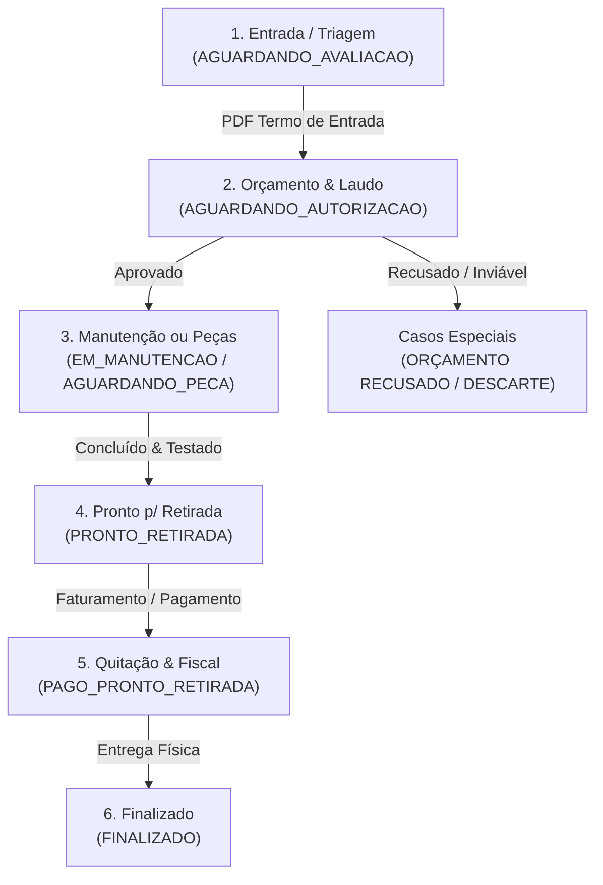

# 📱 Relatório Estratégico e Operacional: Automação Inteligente de WhatsApp & Documentos (MGV One Hub)

> **Autor:** Antigravity AI  
> **Destinatário:** Diretoria e Equipe Técnica MGV Assistência Técnica  
> **Data:** 21 de Agosto de 2026  
> **Versão:** 1.0 — Arquitetura de Comunicação e Experiência do Cliente  

---

## 🎯 1. Sumário Executivo e Visão Estratégica

A assistência técnica da MGV atende a um público altamente qualificado (clínicas de estética, médicos dermatologistas, fisioterapeutas, biomédicos e consultórios) cujos equipamentos representam instrumentos de alto valor financeiro e operacional.

O objetivo desta estratégia é transformar as mensagens de WhatsApp de simples "alertas de robô" em uma **experiência de excelência, transparência e segurança jurídica**, integrando:
1. **Comunicação Humanizada e Acolhedora**: Linguagem profissional, clara e atenciosa.
2. **Envio Automático dos Documentos Oficiais em PDF**: O cliente recebe o laudo pericial, termo de recebimento, recibo assinado, nota fiscal e termos de garantia diretamente na conversa do WhatsApp.
3. **Agilidade no Fechamento Financeiro**: Aprovação de orçamento com 1 clique e facilidade de pagamento via PIX.

---

## 🗺️ 2. Jornada Completa: Etapas da OS × Mensagens × Documentos em PDF

Abaixo está o mapeamento de cada etapa do fluxo do Kanban com o documento correspondente e a mensagem ideal:



---

### 📋 Detalhamento Etapa por Etapa

---

### ETAPA 1: Entrada do Equipamento no Laboratório (`AGUARDANDO_AVALIACAO`)

* **Objetivo:** Passar tranquilidade imediata para o proprietário assim que o aparelho é deixado na oficina ou recebido via transportadora.
* **Documento em Anexo (PDF):**  
  📄 **Termo de Recebimento e Custódia** (`Termo-Recebimento-{os_numero}.pdf`).  
  *Conteúdo:* Dados do cliente, número de série, fotos de entrada, checklist de integridade e lista de acessórios entregues (cabos, manoplas, pedais, cases).
* **Mensagem Sugerida:**
  > 🩺 *Olá, {cliente_nome}!*  
  >  
  > Confirmamos a entrada do seu equipamento *{aparelho_marca} {aparelho_modelo}* em nosso laboratório técnico sob a **OS #{os_numero}**.  
  >  
  > 📎 *Segue em anexo o seu Termo de Recebimento formal com o checklist de entrada.*  
  >  
  > Nossos especialistas já iniciaram a triagem pericial e em breve enviaremos o laudo com o diagnóstico completo.  
  >  
  > 💬 *Se precisar de qualquer informação, estamos à disposição por aqui!*

---

### ETAPA 2: Orçamento Pronto e Laudo Pericial (`AGUARDANDO_AUTORIZACAO`)

* **Objetivo:** Transparência total sobre o defeito encontrado e viabilizar a aprovação rápida sem atrito.
* **Documento em Anexo (PDF):**  
  📄 **Orçamento Detalhado de Assistência Técnica** (`Orcamento-{os_numero}.pdf`).  
  *Conteúdo:* Descrição do defeito, diagnóstico pericial detalhado, relação de peças necessárias, mão de obra, condições de pagamento e validade da proposta.
* **Mensagem Sugerida:**
  > 📋 *Olá, {cliente_nome}!*  
  >  
  > A avaliação técnica do seu *{aparelho_modelo}* (OS **#{os_numero}**) foi finalizada!  
  >  
  > 💰 *Valor Total do Reparo:* **R$ {valor_total}**  
  > 📎 *Em anexo você encontra o Orçamento Oficial detalhado com o laudo pericial das peças.*  
  >  
  > ✨ **Aprovação Online com 1 Clique:**  
  > Para visualizar os detalhes e aprovar seu orçamento com segurança, acesse:  
  > 🔗 {link_portal}  
  >  
  > 💬 *Dúvidas sobre o laudo? Basta nos responder aqui para falar diretamente com o responsável técnico.*

---

### ETAPA 3: Aguardando Peças Originais (`AGUARDANDO_PECA`)

* **Objetivo:** Rastreabilidade e gestão de expectativa quando componentes específicos forem solicitados ao fabricante.
* **Documento:** Sem anexo (notificação de andamento).
* **Mensagem Sugerida:**
  > 📦 *Olá, {cliente_nome}! Atualização sobre sua OS #{os_numero}:*  
  >  
  > Para garantir a máxima qualidade e segurança no conserto do seu *{aparelho_modelo}*, solicitamos componentes novos e originais de fábrica.  
  >  
  > Assim que as peças chegarem em nossa bancada, daremos prioridade imediata à montagem e calibração. Manteremos você informado! ⚙️

---

### ETAPA 4: Em Manutenção Ativa na Bancada (`EM_MANUTENCAO`)

* **Objetivo:** Notificar o cliente de que seu aparelho está em execução técnica.
* **Documento:** Sem anexo (notificação de andamento).
* **Mensagem Sugerida:**
  > ⚙️ *Olá, {cliente_nome}!*  
  >  
  > Informamos que o reparo do seu equipamento *{aparelho_modelo}* (OS **#{os_numero}**) está sendo executado na bancada técnica por nossa equipe especializada.  
  >  
  > Em breve seu aparelho entrará na fase de testes funcionais e calibração! 🔬

---

### ETAPA 5: Equipamento Pronto para Retirada (`PRONTO_RETIRADA`)

* **Objetivo:** Avisar a conclusão dos serviços, apresentar os testes realizados e fornecer instruções de retirada ou PIX.
* **Documento em Anexo (PDF):**  
  📄 **Certificado de Calibração / Laudo Técnico Conclusivo** (`Laudo-Calibracao-{os_numero}.pdf`).  
  *Conteúdo:* Medições de saída, parâmetros elétricos/ópticos/térmicos aferidos e confirmação de conformidade.
* **Mensagem Sugerida:**
  > 🎉 *Ótima notícia, {cliente_nome}!*  
  >  
  > O seu equipamento *{aparelho_modelo}* (OS **#{os_numero}**) concluiu com sucesso todas as etapas de reparo, revisão e calibração técnica!  
  >  
  > 📍 **Seu aparelho já está pronto para retirada na MGV:**  
  > 🏢 *Endereço:* Rua Julio Prestes, 648 - Jardim Sumaré, Ribeirão Preto - SP  
  > ⏰ *Horário:* Segunda a Sexta, das 08h às 18h  
  >  
  > 📎 *Em anexo segue o Certificado de Calibração / Laudo de Conclusão.*  
  >  
  > 💳 *Caso prefira agilizar o faturamento via PIX antes da retirada, basta solicitar a chave por esta conversa.*

---

### ETAPA 6: Faturamento & Emissão Fiscal (`PAGO_PRONTO_RETIRADA` / Faturamento Bling)

* **Objetivo:** Enviar a comprovação de pagamento e as notas fiscais emitidas pelo Bling de forma 100% digital.
* **Documento em Anexo (PDFs):**  
  📄 **DANFE da NF-e** (Peças / Produtos) e/ou  
  📄 **DANFSe da NFS-e** (Serviços e Mão de Obra Técnica) +  
  📄 **Comprovante de Quitação Financeira**.
* **Mensagem Sugerida:**
  > 🧾 *Olá, {cliente_nome}!*  
  >  
  > Confirmamos o faturamento da sua OS **#{os_numero}**!  
  >  
  > 📎 *Seguem em anexo a sua Nota Fiscal (NFS-e / NF-e) e o Comprovante de Pagamento para sua contabilidade.*  
  >  
  > Agradecemos a pontualidade e a confiança em nossos serviços! ✨

---

### ETAPA 7: Entrega do Equipamento & Garantia (`FINALIZADO`)

* **Objetivo:** Formalizar a entrega física e registrar o início da contagem da garantia legal de 90 dias.
* **Documento em Anexo (PDF):**  
  📄 **Recibo de Entrega e Termo de Garantia** (`Recibo-Entrega-{os_numero}.pdf`).  
  *Conteúdo:* Discriminação de serviços, peças trocadas, termo de garantia de 90 dias com cobertura do CDC e assinatura de entrega.
* **Mensagem Sugerida:**
  > 🤝 *Equipamento Entregue com Sucesso!*  
  >  
  > Olá, *{cliente_nome}*! A Ordem de Serviço **#{os_numero}** foi concluída e o seu *{aparelho_modelo}* foi entregue.  
  >  
  > 📎 *Em anexo está o seu Recibo Oficial de Entrega com o Termo de Garantia de 90 dias.*  
  >  
  > Foi um prazer atendê-lo(a)! Se puder nos avaliar ou caso precise de suporte posterior, estamos sempre à sua disposição. 🌟

---

### ⚠️ CASOS ESPECIAIS: Orçamento Recusado ou Descarte Autorizado

#### Caso A: Orçamento Não Aprovado (`ORCAMENTO_RECUSADO`)
* **Documento:** 📄 **Termo de Devolução de Equipamento Sem Reparo**
* **Mensagem:**
  > *Olá, {cliente_nome}!*  
  > Confirmamos o encerramento da proposta de orçamento para a OS **#{os_numero}** ({aparelho_modelo}).  
  > Seu equipamento foi remontado com segurança e está à disposição para retirada em nosso balcão.  
  > 📎 *Em anexo enviamos o Termo de Devolução Sem Reparo.* Agradecemos a consulta e permanecemos à disposição!

#### Caso B: Descarte Técnico e Ambiental Autorizado (`DESCARTE`)
* **Documento:** 📄 **Certificado de Destinação Ambiental e Descarte de Resíduos Eletrônicos**
* **Mensagem:**
  > *Olá, {cliente_nome}!*  
  > Conforme sua solicitação e autorização expressa, o equipamento da OS **#{os_numero}** foi encaminhado para descarte técnico ecológico e reciclagem de componentes eletrônicos conforme as normas ambientais.  
  > 📎 *Segue em anexo o Certificado de Descarte e Baixa Técnica para seus registros patrimoniais.*

---

## 🔍 3. Outros Documentos Estratégicos Identificados na Varredura

Além dos documentos tradicionais citados, nossa varredura identificou que a MGV pode se destacar implementando:

1. **Fotos Periciais em Alta Resolução (Antes vs. Depois):**  
   Enviar no WhatsApp uma foto da placa oxidada/componente queimado e a foto após a restauração técnica. Isso eleva a percepção de valor a um patamar premium.
2. **Chave PIX "Copia e Cola" + Imagem de QR Code PIX:**  
   Enviar a chave PIX e o QR Code diretamente no WhatsApp do cliente no momento que a OS fica "Pronta para Retirada", permitindo que o cliente pague no celular em 10 segundos.
3. **Notificação de Notificação de Custódia (Aviso Preventivo de 60 e 90 dias):**  
   Para equipamentos esquecidos na oficina, o sistema pode disparar um aviso amigável aos 45, 60 e 80 dias antes de caracterizar abandono civil (Art. 1.275 do Código Civil), evitando conflitos jurídicos.

---

## ⚙️ 4. Arquitetura Técnica de Envio de Documentos (Evolution API v2)

Para enviar os documentos em PDF via Evolution API, utilizaremos o endpoint nativo de envio de mídia da Evolution:

* **Endpoint:** `POST https://whatsapp.mgvrp.com.br/message/sendMedia/mgv_oficial`
* **Payload Estruturado:**
```json
{
  "number": "5516991049631",
  "mediatype": "document",
  "mimetype": "application/pdf",
  "caption": "📄 Segue em anexo o seu Orçamento Oficial (OS #234567)",
  "fileName": "Orcamento-234567.pdf",
  "media": "data:application/pdf;base64,JVBERi0xLjQKJ..."
}
```

O backend do MGV One Hub (`pdfService.ts`) já gera os buffers de PDF em tempo real. Basta converter o buffer para `base64` e despachar pela Evolution API.

---

## 🛡️ 5. Políticas de Governança, Anti-Spam e LGPD

1. **Janela de Horário Comercial:**
   - As mensagens só devem ser disparadas de **Segunda a Sexta, das 08:00 às 19:00**, e aos **Sábados das 08:00 às 13:00**.
   - Se um técnico mover um card no Kanban às 22h, o sistema salva o envio como "Agendado" para ser disparado às 08h00 do dia útil seguinte.
2. **Prevenção de Disparos em Loop:**
   - O sistema registra cada disparo na tabela `MessageHistory`. Se o status da OS for alterado duas vezes para a mesma coluna em menos de 10 minutos (ex: engano do atendente), o segundo disparo é bloqueado.
3. **Botão de Envio Manual com Pré-visualização:**
   - Além do envio automático, cada Ordem de Serviço possui uma aba no painel onde o atendente pode visualizar o texto e o PDF antes de clicar em "Enviar Documento via WhatsApp".

---

## 📌 Próximos Passos Recomendados

1. **Aprovação dos Modelos de Texto:** Validar se o tom de voz e as informações dos templates atendem à cultura da MGV.
2. **Implementar a Geração e Envio do PDF no Serviço do WhatsApp:** Conectar o `pdfService.ts` ao `sendMedia` da Evolution API.
3. **Validar no Ambiente de Teste:** Realizar um teste pontual de abertura de OS e recebimento do PDF no celular.
