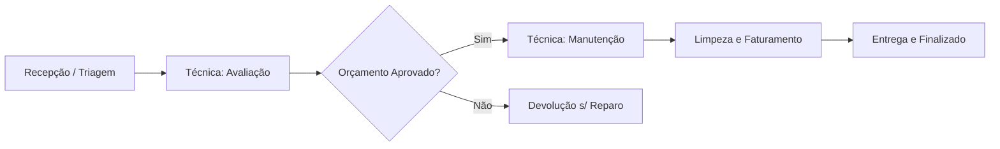

# Manual do Colaborador: Como Usar o Sistema de Assistência Técnica

> [!NOTE]
> Bem-vindo(a)! Este manual foi criado para ajudar você a entender o fluxo de trabalho da nossa Assistência Técnica e como utilizar o sistema no dia a dia.

---

## 1. Visão Geral do Sistema
O nosso sistema organiza todo o trabalho de forma visual usando um **Quadro Kanban**. Pense nele como uma lousa com várias colunas, onde cada "cartão" representa um equipamento de um cliente (uma Ordem de Serviço - OS). 

O seu trabalho é **garantir que os cartões avancem pelas colunas corretas** à medida que o serviço é realizado, mantendo sempre as informações atualizadas.

### O Ciclo de Vida da Ordem de Serviço (OS)

---

## 2. Quando e Como Agir? (Passo a Passo)

### Passo 1: Triagem e Recepção (Setor: Recepção)
**Quando agir:** Quando o cliente chega à loja ou envia um equipamento com defeito.
**Como agir no sistema:**
1. Clique em **Nova OS**.
2. Preencha os dados do **Cliente** e do **Equipamento** (Marca, modelo, número de série).
3. Descreva detalhadamente o **Defeito Relatado** pelo cliente.
4. Preencha o **Checklist de Entrada** e adicione fotos do estado do equipamento.
5. Salve. A OS aparecerá automaticamente na coluna *Aguardando Avaliação*.

### Passo 2: Avaliação e Orçamento (Setores: Técnica e Recepção)
**Quando agir:** Quando o técnico for iniciar a análise e, em seguida, enviar para aprovação.
**Como agir no sistema:**
1. **(Técnica)** Mova o cartão para a coluna **Em Avaliação** (ou diagnostique enquanto "Aguardando Avaliação").
2. **(Técnica)** Após identificar o problema, acesse a OS e adicione o **Laudo Técnico**.
3. **(Técnica)** Insira as peças necessárias e o valor da mão de obra para compor o orçamento, e mova a OS para **Aguardando Aprovação**.
4. **(Recepção)** A equipe da recepção envia o PDF do orçamento ou a mensagem (via WhatsApp) ao cliente. Se aprovado, a recepção move o cartão para **Em Manutenção**. Se recusado, move para **Finalizado** (marcando como devolução sem reparo).

### Passo 3: Manutenção e Limpeza (Setor: Técnica)
**Quando agir:** Assim que o orçamento for aprovado.
**Como agir no sistema:**
1. A OS ficará na coluna **Em Manutenção**. O técnico realiza o conserto físico e os testes de estresse.
2. Se faltar peça, adicione um comentário e mova temporariamente para a coluna **Aguardando Peça**.
3. **Limpeza e Embalagem:** Como passo final antes da liberação, o colaborador responsável deve limpar minuciosamente e embalar o equipamento.

### Passo 4: Faturamento e Cobrança (Setor: Financeiro)
**Quando agir:** Quando o equipamento está consertado, limpo e testado.
**Como agir no sistema:**
1. Mova a OS para a coluna **Pronto / Aguardando Retirada**.
2. O Financeiro acessa o sistema para preparar o faturamento, definir o status do pagamento (Pendente, Pago, Crediário, etc.) e acionar o cliente.

### Passo 5: Entrega ao Cliente (Setor: Comercial / Recepção)
**Quando agir:** Quando o cliente vier retirar o equipamento.
**Como agir no sistema:**
1. Realize a entrega física e acerte os detalhes finais de pagamento.
2. Mova a OS para a última coluna: **Finalizado**.
3. Preencha o **Checklist de Saída** que aparecerá na tela.
4. O sistema cuidará da integração fiscal (Bling) e o contador de garantia de 90 dias começará a rodar automaticamente!

---

## 3. Dicas de Ouro e Boas Práticas

> [!IMPORTANT]
> **O Sistema é o Espelho da Realidade:** Nunca faça um serviço físico sem antes atualizar o cartão no sistema. O que está na bancada deve estar igual no Kanban.

> [!WARNING]
> **Anotações Claras:** Ao adicionar um comentário ou laudo, seja o mais claro possível. Outros colaboradores ou o próprio cliente poderão ler essa informação. Evite termos vagos como "quebrado"; prefira "Conector de carga oxidado e rompido".

> [!TIP]
> **Leia o Histórico:** Antes de começar a mexer em um equipamento que já estava na loja (ex: garantia ou retorno), leia o histórico da OS para entender o que os outros técnicos já fizeram.

---

**Resumo da sua rotina:** 
1. Pegou o equipamento físico? Atualize o sistema. 
2. Terminou uma etapa? Mova o cartão para a próxima coluna. Simples assim!
