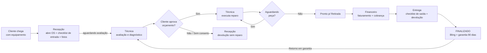

# 📋 Plano de Revisão do Fluxo — MGV One Hub

> [!NOTE]
> **Versão:** 1.2 (Revisada e Melhorada)
> **Data:** Agosto de 2026
> **Status:** Proposta estratégica — **Fase 1 em andamento**: fluxo real já validado em campo (**Mapa A→K**, Seção 3); falta fechar entrevistas detalhadas e a auditoria de dados.
> **Origem:** Consolidação da análise do código-fonte + documentação existente (`docs/fluxo de trabalho/`, `WorkflowVisualizer.tsx`) + discussões com a gestão + **Mapa A→K validado na operação**.

---

## 1. Objetivo deste documento

Este documento é o **norte estratégico** para reduzir falhas e lacunas na operação do MGV One Hub. Ele responde a três perguntas:

1. **Onde estamos?** — O fluxo real da empresa (a validar em campo) versus o fluxo implementado no sistema (o que o código obriga).
2. **O que trava?** — O inventário completo dos bloqueios ("gates") que interceptam a operação, principalmente na finalização da OS.
3. **Para onde vamos?** — A evolução para **boards por setor** (estilo Pipefy), com matriz de papéis e um roadmap em fases para chegar lá sem parar a operação.

> [!IMPORTANT]
> **Nota metodológica (atualizada na v1.2):** o "fluxo real da empresa" da Seção 3 foi **validado em campo** e consolidado no **Mapa A→K** (etapas + anotações da operação). Ele substitui a hipótese original. Ainda em aberto (Fase 1): entrevistas detalhadas por setor e a auditoria de dados — a diferença entre o fluxo real e o implementado continua sendo o inventário das lacunas (Seção 6).

---

## 2. Visão geral da operação

A MGV é uma assistência técnica de **equipamentos estéticos** (ultrassom, autoclaves, etc.). O ciclo de vida de uma Ordem de Serviço (OS) atravessa, na prática, **quatro setores**:

| Setor | Quem faz | O que faz |
|---|---|---|
| **Recepção / Triagem** | Atendente | Recebe o equipamento, abre a OS, registra o defeito relatado, checklist de entrada + fotos |
| **Técnica / Laboratório** | Técnico | Avalia, diagnostica, orça, aloca peças, executa o reparo, teste de estresse |
| **Comercial / Entrega** | Atendente + Supervisor | Aprovação do orçamento com o cliente, devolução sem conserto, entrega |
| **Financeiro** | Financeiro + Gestão | Faturamento (Bling/NFe), cobrança, crediário, quitação |

Gestores e donos **(OWNER / ADMIN / SUPERVISOR)** transitam estrategicamente por todos os setores — hoje o sistema já reflete isso no código: a máquina de estados é **ignorada (bypass)** para esses papéis (`src/controllers/os.controller.ts`).

---

## 3. Fluxo real da empresa (validado — Mapa A→K)

> [!TIP]
> **Validado em campo:** Este é o fluxo **como a operação funciona no chão de fábrica**, consolidado no **Mapa A→K** a partir das anotações da gestão. As anotações de campo estão catalogadas na Seção 3.2 com as implicações para o sistema.

### 3.1. O Mapa A→K



| Letra | Setor | Etapa |
|---|---|---|
| **A → B** | Recepção | Cliente chega → abre OS + checklist de entrada + fotos → equipamento para o setor "aguardando avaliação" |
| **B → C** | Técnica | Avaliação e diagnóstico (o técnico pega o equipamento, abre na bancada e avisa a recepção) |
| **C → D** | Aprovação | "Cliente aprova o orçamento?" — 10 variações de decisão (Seção 3.2, anotação 2) |
| **D → Sim** | Técnica | Recepção avisa o técnico → executa reparo (E); sem peça em estoque e cliente aceitou esperar → "aguardando peça" |
| **D → Não (F)** | Recepção | Devolução sem reparo (variações na Seção 3.2, anotação 3) |
| **E → G** | Técnica | "Aguardando peça?" — Sim → volta para E; Não → H |
| **G → H** | Técnica | **Limpeza + embalagem** por colaborador dedicado → "pronto para retirada" |
| **H → I** | Financeiro | Faturamento + cobrança |
| **I → J** | Entrega | Checklist de saída + devolução |
| **J → K** | Finalização | FINALIZADO → Bling + garantia de 90 dias |
| **K → C** | Técnica | Retorno em garantia → volta para avaliação/diagnóstico |

### 3.2. Anotações da operação (de campo) e implicações no sistema

Cada anotação revela um comportamento real da operação que o sistema **não enxerga hoje** — e vira lacuna rastreada na Seção 6 (itens 9–12).

| # | Onde | Anotação (o que a operação faz) | Implicação no sistema | Lacuna |
|---|---|---|---|---|
| 1 | **B → C** | O técnico pega o equipamento, abre na bancada e **avisa a recepção**; a **própria recepção** envia o **PDF do orçamento ou mensagem pelo WhatsApp** | O envio do orçamento é tarefa da recepção (não do técnico) e **não é registrado**: sem data, canal ou responsável | #10 |
| 2 | **C → D** | O cliente pode: aprovar total · aprovar parcialmente · recusar · falar com o técnico · descartar o equipamento · solicitar desconto · devolução sem conserto · solicitar parcelamento · entregar sem reparar · aprovar o valor total | O sistema só conhece **aprovado/recusado** (`AGUARDANDO_AUTORIZACAO`). Decisões parciais (parcial, desconto, parcelamento, "entregar sem reparar") **não têm onde morar** | #11 |
| 3 | **D → Não (F)** | O cliente pode: devolver sem reparar · falar com o técnico · descartar · solicitar desconto · **devolução com entrega em mãos** · **só vir retirar** | O gate de sem-reparo cobre o **motivo**, mas não o **modo de entrega** (retirada presencial × entrega em mãos) | #12 |
| 4 | **E → G → H** | **Sempre** antes de colocar em "pronto para retirada", um colaborador **limpa e embala** o equipamento | Passo obrigatório da operação **invisível no sistema**: sem status, responsável ou registro | #9 |
| 5 | **K → C** | Retorno em **garantia (90 dias)** volta para a Técnica (avaliação/diagnóstico) | Já suportado pela FSM (`FINALIZADO → AGUARDANDO_AVALIACAO` / `EM_MANUTENCAO`) + badge de garantia (gate 10) | ✅ Sem ação |

### 3.3. Mapa A→K × status do sistema (ponte real ↔ implementado)

| Mapa A→K | Status no sistema | Gates envolvidos |
|---|---|---|
| A → B | `AGUARDANDO_AVALIACAO` (criação da OS) | Checklist de entrada + fotos (tela de criação) |
| B → C | `AGUARDANDO_AVALIACAO → AGUARDANDO_AUTORIZACAO` | Laudo/diagnóstico + orçamento gerado |
| C → D | `AGUARDANDO_AUTORIZACAO` | Decisão do cliente — **fora do sistema hoje** (lacuna 11) |
| D → Sim (E) | `AGUARDANDO_AUTORIZACAO → EM_MANUTENCAO` | — |
| D → Não (F) | `AGUARDANDO_AUTORIZACAO → FINALIZADO` (sem reparo) | Gate 3 (motivo de encerramento) |
| E → G | `EM_MANUTENCAO ↔ AGUARDANDO_PECA` | — |
| G → H | `EM_MANUTENCAO → PRONTO_RETIRADA` | Gates 6–9 (laudo, custo, serial, estresse) + **limpeza/embalagem sem gate** (lacuna 9) |
| H → I | `PRONTO_RETIRADA` / `PAGO_PRONTO_RETIRADA` + `financialStatus` | Cobrança |
| I → J | `PRONTO_RETIRADA → FINALIZADO` | Gate 1 (checklist de saída — ✅ consistente) + gate 2 (fiscal) |
| J → K | `FINALIZADO` | Gates 1–10 → Bling/faturamento + garantia 90 dias |
| K → C | `FINALIZADO → AGUARDANDO_AVALIACAO` / `EM_MANUTENCAO` | Gate 10 (badge garantia) |

> [!WARNING]
> **Leitura rápida:** As etapas que existem no mapa A→K, mas **não têm status próprio** no sistema, são as maiores lacunas — **limpeza/embalagem** (G→H) e o **registro granular da decisão do cliente** (C→D).

### 3.4. Pontos de atenção remanescentes (a confirmar em entrevistas)

- Onde o fluxo "morre" hoje? (OS paradas por falta de retorno do cliente, peça em trânsito, cobrança não feita…)
- O que é feito fora do sistema? (WhatsApp, caderno, planilha — tudo que não está registrado é lacuna de rastreabilidade)
- Quem decide o quê? (quem autoriza desconto, quem aprova orçamento, quem "desbloqueia" OS travada)

---

## 4. Fluxo implementado no sistema

### 4.1. Estados da OS

`src/types.ts`:

```
AGUARDANDO_AVALIACAO → AGUARDANDO_AUTORIZACAO → AGUARDANDO_PECA → EM_MANUTENCAO
→ PRONTO_RETIRADA → PAGO_PRONTO_RETIRADA → FINALIZADO
```

### 4.2. Máquina de estados (FSM)

`src/domain/os/os.state-machine.ts` — **14 transições válidas**, configuráveis em runtime via `officeSetting` (`OS_ALLOWED_TRANSITIONS`). Exemplos:

- `AGUARDANDO_AVALIACAO → AGUARDANDO_AUTORIZACAO`
- `AGUARDANDO_AUTORIZACAO → EM_MANUTENCAO | AGUARDANDO_PECA | FINALIZADO` (sem reparo)
- `EM_MANUTENCAO → PRONTO_RETIRADA | AGUARDANDO_PECA`
- `PRONTO_RETIRADA → PAGO_PRONTO_RETIRADA | FINALIZADO | EM_MANUTENCAO`
- `FINALIZADO → EM_MANUTENCAO | AGUARDANDO_AVALIACAO` (reabertura / garantia)

**Bypass para gestores:** OWNER, ADMIN e SUPERVISOR podem pular a FSM (desbloqueio manual) — necessário, mas deve ser auditável.

### 4.3. Dimensões que o sistema já modela

O visualizador de fluxo existente (`docs/fluxo de trabalho/README.md`) documenta uma **matriz tridimensional** que o sistema já suporta parcialmente:

| Dimensão | Estados | Onde no código |
|---|---|---|
| **Status** | Operacional → Execução → Concluído | `status` da OS |
| **Custódia** | Na oficina, entrega temporária, entrega definitiva | `originalExitDate` / `warrantyDate` |
| **Pagamento** | Sem pagamento, parcial, quitado | `financialStatus` (PENDENTE, CREDIARIO, PAGAR_DEPOIS, PAGO, INADIMPLENTE) |

O Kanban já tem o **toggle Técnico × Financeiro** (`viewMode` no `KanbanBoard.tsx`) — o embrião dos boards por setor (Seção 7).

### 4.4. Eventos e auditoria

O sistema tem um **barramento de eventos** (`src/events/`) que emite `OS_CREATED`, `OS_UPDATED`, `OS_STATUS_CHANGED`, `OS_DELETED` — este é o gancho perfeito para os "connectors" automáticos do Pipefy (Seção 7.3).

---

## 5. Inventário dos gates (bloqueios) na finalização

Levantamento direto do código: **10 pontos de controle** que interceptam a transição para `FINALIZADO` (e alguns para `PRONTO_RETIRADA`). Cada gate é uma decisão de processo embutida em código — entender todos eles é entender onde a operação pode travar.

| # | Gate | Onde atua | Quem dispara | O que valida | Modo de falha |
|---|---|---|---|---|---|
| 1 | **Checklist de saída** | Frontend (Kanban: arrasto + botão) | Todos | OS tem checklist de saída salvo antes de finalizar | ✅ **Consistente desde Ago/2026** (Opção A: bloqueia e retoma automaticamente) |
| 2 | **Validação fiscal do cliente** | Frontend (`validateFiscalData`) | Todos | CPF/CNPJ, endereço, IE, cidade/UF válidos para NF-e | Modal de correção fiscal; OS fica retida |
| 3 | **Encerramento sem reparo** | Frontend (modal) | Atendente | Motivo: ORCAMENTO_RECUSADO, SEM_CONSERTO, DESCARTE_CLIENTE_RETIRA, DESCARTE_OFICINA | Requer confirmação explícita |
| 4 | **Cálculo de lucro** | Frontend (modal) | **OWNER** (flag `OS_PROFITABILITY_CALC`) | Conferência de rentabilidade antes de fechar | Apenas dono; não bloqueia demais papéis |
| 5 | **Dispositivo incompleto** | Backend (`DEVICE_INCOMPLETE`) | Todos | Marca, modelo e nº de série preenchidos | Modal de onboarding (Base Instalada) |
| 6 | **Laudo técnico obrigatório** | Backend (`DIAGNOSTIC_REQUIRED`) | Todos | `diagnostic` preenchido para FINALIZADO (e PRONTO_RETIRADA se config) | Erro 422 "preencha o Laudo Técnico" |
| 7 | **Custo obrigatório** | Backend (`COST_REQUIRED`) | Todos | Mão de obra **ou** peças > 0 | Erro 422 "OS sem custo" |
| 8 | **Serialização de peças** | Backend (`SERIAL_REQUIRED` — `OSPolicies`) | Todos | Peças com `requiresSerial` têm nº de série | Erro 422 listando peças |
| 9 | **Teste de estresse 30 min** | Frontend (widget) | Técnico | Equipamento sob carga por 30 min antes de finalizar | Widget de contagem regressiva |
| 10 | **Alerta de recorrência / garantia** | Frontend (badge) | — | Sinaliza (não bloqueia) OS com >2 retornos em 90 dias / em garantia | Aviso no card |

**Observações-chave:**
- Gates 1–4 e 9 são **frontend**; 5–8 são **backend**. Um gate frontend pode ser "furado" (ex.: a FSM é contornada por gestor) — os do backend são a trava real.
- A **ordem** de execução dos gates no botão de status é: **1 → 2 → 3 → 4 → PUT /status → (5–8 no backend) → Bling**.
> [!CAUTION]
> **Atenção ao acúmulo:** São 10 controles numa única transição. O risco maior não é a existência deles, mas a **experiência fragmentada do usuário**, que acaba tendo que "adivinhar" qual bloqueio virá a seguir, causando frustração. A Seção 9 propõe uma **Pipeline Única de Finalização** para mitigar esse gargalo de UX.

---

## 6. Lacunas identificadas (fluxo real × implementado)

Lacunas com **evidência no código** (itens 1–8) ou **nas anotações de campo do Mapa A→K** (itens 9–12), priorizadas por severidade. As marcadas ✅ já foram corrigidas.

| # | Lacuna | Severidade | Evidência / Correção |
|---|---|---|---|
| 1 | ✅ **Arrasto para FINALIZADO virava loop** — abria o checklist repetidamente e nada acontecia, mesmo com checklist salvo | 🔴 Crítica | `handleDrop` interceptava só pelo `billingStatus` e a listagem não retornava `checklistSaida`. **Corrigido (Opção A)** — gates 1 consistente e retomada automática |
| 2 | ✅ **Botão "Finalizar" furava o checklist** — finalizava sem checklist salvo | 🔴 Crítica | `handleStatusChangeBtn` não tinha o gate. **Corrigido** — gate 1 agora cobre arrasto e botão |
| 3 | **Interceptação duplicada** — `handleDrop` e `handleStatusChangeBtn` repetem a mesma sequência de gates | 🟡 Média | Duas implementações paralelas = risco de divergir no futuro. Sugestão: **pipeline única de finalização** |
| 4 | **Critério "checklist salvo" = tem itens** — salvar o padrão (tudo "NA") dispensa o gate | 🟡 Média | Decisão de processo: exigir ≥ 1 item avaliado (status ≠ "NA")? |
| 5 | **FMS contornável por gestor** — OWNER/ADMIN/SUPERVISOR pulam as transições | 🟡 Média | Necessário para desbloqueio, mas cada bypass deveria gerar alerta/auditoria destacada |
| 6 | **Sem WIP limit nem SLA por coluna** — dashboard só tem alerta global de >15 dias | 🟡 Média | Telemetria por board/coluna (Seção 9, Fase 4) |
| 7 | **Sem visão "todos os boards" para o gestor** — hoje é um board único com toggle | 🟢 Baixa | A visão consolidada é o "todos os pipes" do Pipefy |
| 8 | **Sem indicador de quem está com a OS** (responsável por status) | 🟢 Baixa | Dificulta cobrança interna por setor |
| 9 | **"Preparação para entrega" (limpeza + embalagem) invisível no sistema** — colaborador dedicado limpa e embala antes de `PRONTO_RETIRADA`, sem etapa nem registro | 🟡 Média | Anotação E→G→H do Mapa A→K. Candidato: sub-etapa configurável (status ou checklist de preparação) entre `EM_MANUTENCAO → PRONTO_RETIRADA` |
| 10 | **Envio do orçamento não rastreado** — a recepção envia o PDF/mensagem via WhatsApp, sem data/canal/responsável no sistema | 🟡 Média | Anotação B→C do Mapa A→K. Candidato: botão "Enviar orçamento" na OS + registro `orcamentoEnviadoEm` |
| 11 | **Decisões do cliente na aprovação não modeladas** — aprovar parcialmente, solicitar desconto, parcelamento e "entregar sem reparar" não têm onde morar (o sistema só distingue aprovado/recusado) | 🟡 Média | Anotação C→D do Mapa A→K. Candidato: `decisaoCliente` + `valorAprovado`, `desconto`, `parcelas` |
| 12 | **Modo de entrega não modelado** — "devolução com entrega em mãos" × "só vir retirar" são modos distintos de entrega que o sistema não distingue | 🟢 Baixa | Anotação D→Não do Mapa A→K |

---

## 7. Boards por setor (estilo Pipefy)

### 7.1. Por que funciona aqui

O Pipefy separa o trabalho em **pipes** (um por setor), com **connectors** automatizando a passagem de cards entre pipes. No MGV One Hub isso é natural, porque:

- Os **papéis do sistema já são por setor**: `ATTENDANT` (recepção), `TECHNICIAN` (técnica), `FINANCIAL` (financeiro).
- O **status da OS já é uma linha reta** que atravessa os setores — basta **agrupar status por board**.
- O **toggle Técnico × Financeiro já existe** — é o primeiro passo já dado.

### 7.2. Desenho proposto (4 boards)

| Board | Responsável | Colunas (status) | Entrada (connector) | Saída (connector) |
|---|---|---|---|---|
| **1. Recepção / Triagem** | `ATTENDANT` | AGUARDANDO_AVALIACAO, AGUARDANDO_AUTORIZACAO | Criação da OS | Orçamento aprovado/recusado |
| **2. Técnica / Laboratório** | `TECHNICIAN` | AGUARDANDO_PECA, EM_MANUTENCAO | Autorização do cliente | Reparo concluído (gates 6–9) |
| **3. Comercial / Entrega** | `ATTENDANT` + `SUPERVISOR` | PRONTO_RETIRADA, PAGO_PRONTO_RETIRADA | Pronto p/ retirada | Retirada + checklist (gate 1) |
| **4. Financeiro** | `FINANCIAL` | FINALIZADO + `financialStatus` (PENDENTE, CREDIARIO, PAGAR_DEPOIS, PAGO, INADIMPLENTE) | Finalização da OS | Quitação → arquivo |

> [!NOTE]
> **Já existe hoje:** O board 4 é literalmente o modo financeiro do Kanban (`FINANCIAL_COLUMNS`). O trabalho principal agora é formalizar e separar os demais.

### 7.3. Connectors (handoffs automáticos)

No Pipefy, um connector move o card entre pipes. No MGV, os connectors já existem como **transições de status** — e o `eventBus` (`OS_STATUS_CHANGED`) é o gancho para automatizá-los:

- **Recepção → Técnica:** ao aprovar orçamento → notifica o board técnico (WhatsApp interno / notificação).
- **Técnica → Comercial:** ao chegar em `PRONTO_RETIRADA` → avisa recepção para contatar o cliente.
- **Comercial → Financeiro:** ao finalizar → dispara faturamento Bling (já implementado no backend).
- **Financeiro → Arquivo:** ao quitar (`PAGO`) → avisa entrega / encerra o ciclo.
- **Reabertura:** `FINALIZADO → EM_MANUTENCAO` (garantia 90 dias) → devolve o card ao board técnico automaticamente.

### 7.4. Regras de ouro (para não repetir o problema atual)

1. **Não mudar o banco de dados.** A OS é uma entidade única (`ordem_servicos.status` + `financialStatus`). Board é **camada de visão/configuração** — criar tabelas por board seria o erro clássico do Pipefy mal implementado.
2. **Um card nunca "some".** O problema atual é o card preso num ponto com 10 gates; em 5 boards, o risco vira card "perdido" entre pipes. Mitigação: **visão consolidada do gestor** (todos os boards numa tela) + contador de WIP por board.
3. **Configurável, não hardcoded.** Usar o padrão que já existe (`officeSetting` com `OS_ALLOWED_TRANSITIONS`): uma config de boards (board → status → papéis) permite mudar setores sem deploy.

### 7.5. Implementação técnica (resumo)

- **Config:** tabela ou `officeSetting` JSON: `Board { id, nome, ordem }`, `BoardStatus { boardId, status, ordem }`, `BoardRole { boardId, role }`.
- **Frontend:** o `KanbanBoard` recebe o board ativo por `userRole` (ou uma rota `/api/boards/me`) e renderiza só as colunas do board — aproveitando `FINANCIAL_COLUMNS` como modelo.
- **Gestor:** flag "ver todos os boards" → renderiza todos com separadores visuais por setor.
- **eventBus:** os connectors disparam handlers de notificação (WhatsApp) e automações em cada `OS_STATUS_CHANGED`.

---

## 8. Matriz de papéis × boards

Papéis reais do sistema (`src/types.ts`) e acesso proposto por board:

| Papel | Recepção | Técnica | Comercial/Entrega | Financeiro | Observações |
|---|---|---|---|---|---|
| **OWNER** (Dono) | ✅ Total | ✅ Total | ✅ Total | ✅ Total | Bypass FSM; vê todos os boards; única role com modal de lucro |
| **ADMIN** | ✅ Total | ✅ Total | ✅ Total | ✅ Total | Bypass FSM |
| **SUPERVISOR** | 👁️ Ver | 👁️ Ver | ✅ Total | 👁️ Ver | Bypass FSM; aprova desbloqueios |
| **ATTENDANT** (Recepção) | ✅ Criar/mover | 👁️ Ver | ✅ Mover/editar | 👁️ Ver | FSM obrigatória |
| **TECHNICIAN** (Técnico) | 👁️ Ver | ✅ Criar/mover/editar | ✅ Mover | 👁️ Ver | FSM obrigatória |
| **FINANCIAL** (Financeiro) | 👁️ Ver | 👁️ Ver | ✅ Mover | ✅ Mover (financialStatus) | FSM obrigatória |
| **EDITOR** (legado) | 👁️ Ver | 👁️ Ver | 👁️ Ver | 👁️ Ver | Role legada — avaliar desativação |

**Legenda:** ✅ = acesso pleno ao board · 👁️ = somente leitura · FSM = máquina de estados aplicada (sem bypass).

> [!WARNING]
> **Nota de segurança:** O bypass da FSM para gestores é uma alavanca poderosa, mas arriscada. Recomenda-se que cada transição via bypass gere um **evento de auditoria destacado** (o `eventBus` já registra `OS_STATUS_CHANGED` com `actor`), garantindo rastreabilidade contra inconsistências forçadas.

---

## 9. Roadmap em fases

### Fase 0 — Estabilização (em andamento)
Curativos que param o sangramento sem parar a operação:
- [x] Gate do checklist consistente entre arrasto e botão (Opção A).
- [x] Listagem retorna `checklistSaida`.
- [ ] **(Ação)** Decidir o critério do checklist: "tem itens" ou "≥1 item avaliado".
- [ ] **(Ação)** Refatorar os gates em **pipeline única de finalização** (elimina a duplicação `handleDrop` × `handleStatusChangeBtn`).

### Fase 1 — Diagnóstico (em andamento)
- [x] **Mapa A→K produzido e validado na operação** (Seção 3) — fluxo real consolidado com anotações de campo (Seção 3.2) e cruzamento com o sistema (Seção 3.3).
- [ ] **Entrevistas detalhadas por setor** (recepção, técnica, financeiro, entrega): confirmar as anotações e onde o processo "morre".
- [ ] **Auditoria de dados:** OS paradas por status + idade; `billingStatus` REJEITADO/PENDENTE; percentual de OS sem checklist.
- [ ] **Fechar o delta real × implementado** com as novas lacunas da Seção 6 (itens 9–12) e revisar o inventário de gates (Seção 5) com a gestão: quais **devem** ser travas e quais são só atrito.

### Fase 2 — Desenho do fluxo-alvo (1 semana)
- [ ] Aprovar os **4 boards** (Seção 7.2) e a **matriz de papéis** (Seção 8).
- [ ] **Modelar dados** para acomodar as lacunas 9–12 (ex: criar campos `decisaoCliente`, `valorAprovado`, e oficializar a sub-etapa de Limpeza/Embalagem).
- [ ] Definir **gates essenciais** por board (menos é mais: cada gate tem custo de operação).
- [ ] Definir **WIP limits e SLAs por coluna** (ex.: avaliação ≤ 2 dias, aguardando peça ≤ 7 dias).
- [ ] Definir **connectors/automações** e as notificações (WhatsApp) de cada handoff.

### Fase 3 — Implementação incremental (3–6 semanas)
- [ ] **Config de boards** (backend + tabela/config) e roteamento por `userRole`.
- [ ] **Visão consolidada do gestor** (todos os boards + filtros por setor — inspirado no `sectorFilter.js` existente).
- [ ] **Connectors** no `eventBus` (notificações por handoff e integrações WhatsApp).
- [ ] **Telemetria por board** (tempo médio por coluna, WIP, taxa de bloqueio) — evoluir o dashboard (SLA 15 dias global → SLA por coluna).
- [ ] Testes E2E do fluxo de finalização (`tests/homologacao_fluxo.test.ts` como base).

### Fase 4 — Monitoramento e melhoria contínua
- [ ] Revisão mensal do inventário de gates (remover gates que viraram atrito sem proteger).
- [ ] Alertas de SLA por board (notificação quando OS estourar o tempo da coluna).
- [ ] Retrospectiva trimestral com os setores (o fluxo é da operação, o sistema é o reflexo).

---

## 10. Referências

**Código-fonte:**
- `src/types.ts` — `OSStatus`, `UserRole`, `OrdemServico`
- `src/domain/os/os.state-machine.ts` — FSM e transições dinâmicas
- `src/domain/os/os.policies.ts` — política de serialização
- `src/controllers/os.controller.ts` — `updateStatus` (gates backend + fiscal/Bling)
- `src/components/KanbanBoard.tsx` — gates frontend, toggle Técnico × Financeiro
- `src/events/` — barramento de eventos (connectors)
- `src/components/WorkflowVisualizer.tsx` — visualização do fluxo no app

**Documentação existente:**
- `docs/fluxo de trabalho/README.md` — visualizador de fluxo (filtros, FSM, dashboard)
- `docs/fluxo de trabalho/01_PRD_REQUIREMENTS.md` — requisitos do produto
- `docs/fluxo de trabalho/modules/sectorFilter.js` — filtro por setor (inspiração dos boards)
- `docs/contexto_sistema_mgv.md` — base de conhecimento do sistema
- `docs/manual_uso_boas_praticas.md` — manual de boas práticas da operação
- `docs/formularios_e_guarda_alteracoes.md` — formulários e guarda de alterações

---

*Fim do documento — Próximo passo: fechar a Fase 1 (entrevistas + auditoria de dados) ou decidir os curativos da Fase 0 (pipeline única de finalização).*
