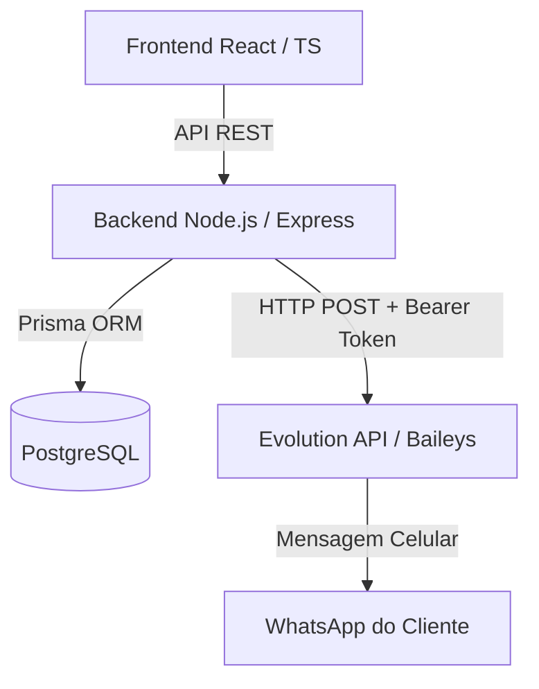

# PRD (Product Requirement Document) - Integração WhatsApp

Este documento detalha os requisitos do produto, regras de negócio e arquitetura tecnológica para o subprojeto de **Integração com WhatsApp** no sistema **MGV One Hub**. Ele serve como guia didático tanto para desenvolvedores quanto para partes interessadas entenderem a estrutura e o funcionamento do sistema.

---

## 1. Visão Geral do Produto
O objetivo principal desta integração é otimizar e automatizar a comunicação entre a assistência técnica e o cliente final. O sistema notifica o cliente automaticamente em momentos críticos do ciclo de vida de uma **Ordem de Serviço (OS)**, reduzindo o tempo de atendimento telefônico e melhorando a transparência.

### Problemas Resolvidos
* **Comunicação manual lenta:** Evita que os atendentes tenham que digitar mensagens manuais no WhatsApp Web ou ligar para cada atualização.
* **Falta de visibilidade para o cliente:** O cliente passa a receber links diretos para acompanhar o status e aprovar o orçamento.
* **Histórico descentralizado:** Permite que a equipe veja diretamente na OS quais mensagens foram enviadas e se foram entregues com sucesso.

---

## 2. Atores do Sistema
* **Técnico / Atendente:** Utiliza o painel da OS no sistema para conferir o andamento, carregar templates rápidos e enviar mensagens manuais.
* **Administrador:** Acessa a tela de configurações para parear a API e gerenciar as credenciais.
* **Cliente Final:** Recebe as mensagens no celular e acessa o portal através do link fornecido.

---

## 3. Stack Tecnológica (Didático)
A arquitetura é dividida em camadas lógicas para garantir separação de responsabilidades (Frontend, API/Backend, Banco de Dados, e o Gateway externo de WhatsApp).

### Camada por Camada:

#### A. Frontend (Interface do Usuário)
* **React + TypeScript:** Fornece uma interface rica e reativa. O TypeScript garante que os dados trocados entre componentes tenham formatos seguros e tipados.
* **CSS Customizado (TailwindCSS):** Estilização ágil baseada em classes utilitárias, permitindo um visual limpo e responsivo.
* **Material Symbols:** Ícones universais e elegantes usados para representar ações (ex: ícone de enviar, engrenagem, refresh).
* **Guarda de Alterações Não Salvas (`useUnsavedChangesGuard`):** Gancho personalizado que detecta se o usuário digitou uma mensagem manual e tenta sair da tela sem enviar, exibindo um alerta de segurança para evitar perda de digitação.

#### B. Backend (Servidor de Aplicação)
* **Node.js + Express:** Servidor web rápido que expõe endpoints REST para o frontend.
* **TypeScript:** Utilizado também no backend para garantir consistência de tipos com o banco de dados.
* **Arquitetura Assíncrona:** O envio real da mensagem de WhatsApp é feito de forma assíncrona (com `setTimeout` e processamento em segundo plano) para que a alteração de status da OS não demore a responder para o usuário no frontend.

#### C. Banco de Dados e Mapeamento (Persistência)
* **PostgreSQL:** Banco de dados relacional robusto.
* **Prisma ORM:** Ferramenta que mapeia as tabelas do banco de dados em objetos no código TypeScript.
  * **Tabela `MessageHistory` (`message_history`):** Armazena o registro de cada mensagem (data/hora de criação, número de telefone do destinatário, texto formatado, status e mensagem de erro).
  * **Tabela `FeatureFlag` (`feature_flags`):** Controla se funcionalidades (como envio de WhatsApp automático) estão ativas ou inativas sem precisar re-compilar o código.

#### D. Integração de Rede (Gateway WhatsApp)
* **Evolution API / Baileys:** Serviço externo que gerencia a conexão com o protocolo do WhatsApp, oferecendo endpoints HTTP REST para envio de texto e controle de sessões (QR Code).
* **Modo Simulado / Fallback:** Se o sistema não possuir `WHATSAPP_API_URL` ou `WHATSAPP_API_TOKEN` cadastrados no `.env` ou nas configurações do banco, o backend redireciona o fluxo para um **Modo Simulado**, mostrando o texto no terminal e alterando o status para "ENVIADO". Isso permite testar todo o fluxo do sistema localmente sem gastar saldo ou disparar mensagens de verdade.

---

## 4. Requisitos Funcionais (RF)

| ID | Requisito | Descrição |
|---|---|---|
| **RF-001** | **Envio Automático por Status** | O sistema dispara mensagens automáticas nos status: `AGUARDANDO_AUTORIZACAO` (quando o orçamento é conciliado), `PRONTO_RETIRADA` e `FINALIZADO` (nos casos de orçamento recusado ou descarte). |
| **RF-002** | **Envio Manual de Mensagem** | O usuário pode digitar um texto livre na aba de WhatsApp dentro da OS e enviá-lo diretamente ao telefone do cliente cadastrado. |
| **RF-003** | **Templates Rápidos** | O sistema disponibiliza botões para preencher o campo de texto instantaneamente com mensagens padrão da empresa. |
| **RF-004** | **Histórico de Comunicação** | Exibe na aba da OS uma lista cronológica de todas as mensagens associadas àquela OS, com data, hora, texto enviado e status (`PENDENTE`, `ENVIADO` ou `FALHOU` com erro correspondente). |
| **RF-005** | **Geração de PDF** | Permite salvar o arquivo PDF detalhado do orçamento na mesma aba para posterior envio manual, caso o cliente prefira. |
| **RF-006** | **Painel de Configuração** | Tela administrativa para configurar URL, Token, Instância da Evolution API e gerenciar o pareamento do WhatsApp com simulação de leitura de QR Code. |

---

## 5. Requisitos Não-Funcionais (RNF)

* **RNF-001 - Segurança das Credenciais:** Tokens e URLs da API de WhatsApp nunca devem ser expostos diretamente ao frontend ou gravados em variáveis locais no navegador. A comunicação deve ser feita exclusivamente via backend (`/api/config` e rotas seguras do controlador).
* **RNF-002 - Desempenho e Concorrência:** O disparo das mensagens é feito em background. Se a API de WhatsApp demorar para responder ou estiver offline, isso não pode travar ou lentificar a interface do atendente.
* **RNF-003 - Resiliência e Tratamento de Falhas:** Em caso de queda do gateway, o erro de conexão HTTP deve ser capturado no catch e gravado no campo `errorDetail` da tabela `message_history` para auditoria posterior.

---

## 6. Regras de Negócio (RN)

1. **Bloqueio de Orçamento Vazio:** Não é permitido disparar notificações de `AGUARDANDO_AUTORIZACAO` se o valor total da OS for igual a zero ou se o diagnóstico não estiver preenchido.
2. **Uso de Feature Flag:** A chave `WHATSAPP_AUTO_MESSAGES` deve ser consultada antes de qualquer disparo automático. Se inativa, a execução aborta silenciosamente registrando o motivo no console.
3. **Formatação do Telefone:** Caracteres não numéricos (parênteses, traços, espaços) devem ser limpos no backend antes do envio da carga útil para a API (regex `\D`).
4. **Formatação Dinâmica de Variáveis:** O backend substitui dinamicamente os valores das variáveis:
   * `{cliente_nome}`: Primeiro nome do cliente (extraído fazendo split pelo espaço).
   * `{os_numero}`: Número visual da OS (ex: OS 1234).
   * `{aparelho_modelo}` / `{aparelho_marca}`: Identificação do modelo e marca do aparelho.
   * `{valor_total}`: Valor formatado no padrão brasileiro (ex: `150,00`).
   * `{link_portal}`: Link dinâmico com o número da OS e CPF/CNPJ limpo do cliente para login automático no portal de aprovação rápida.

---

## 7. Planilhas de Testes e Validação

### Testando Envio Automático
1. Acesse o Kanban ou lista de ordens de serviço.
2. Atualize o status de uma OS para `PRONTO_RETIRADA`.
3. Verifique se o registro de histórico foi criado na tabela com status `ENVIADO` (no modo simulado) e cheque o console do servidor Node.js para ver o log simulado.
4. Repita o processo ativando e desativando a feature flag `WHATSAPP_AUTO_MESSAGES` nas configurações para garantir que o comportamento seja respeitado.

### Testando Envio Manual
1. Abra uma OS e clique na aba de Comunicação/WhatsApp.
2. Selecione o template rápido "Orçamento Pronto".
3. Altere alguma palavra na caixa de texto.
4. Tente clicar em fechar a aba ou ir para outra tela sem enviar para validar se a tela exibe o aviso de alterações não salvas.
5. Volte e clique em **Enviar**. A mensagem deve ser salva no histórico em até 2 segundos com status `ENVIADO`.
