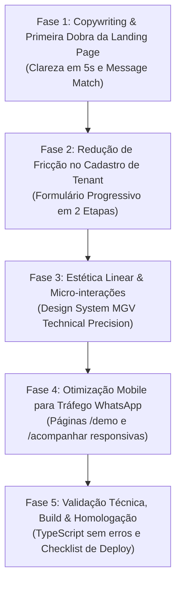

# 🚀 Plano de Implementação: Redesign do Funil de Conversão, Estética & Landing Pages (OS-Flow SaaS)

> **Documento:** Plano de Execução Técnica & UI/UX  
> **Versão:** 1.0  
> **Status:** Pronto para Execução  
> **Alinhamento:** Playbook GTM Estética, Design System MGV Technical Precision & Framework 4Cs de Conversão  

---

## 🎯 1. Objetivo Central

Transformar o primeiro contato do lead (dono ou gestor de assistência técnica que clica no link do WhatsApp) em uma experiência de altíssimo valor percebido e conversão imediata, eliminando pontos de fricção no cadastro e unificando a estética da plataforma com o padrão visual *Linear / Technical Precision*.

---

## 🗓️ 2. Fases de Execução & Entregáveis

---

### 🔹 Fase 1: Copywriting & Otimização da Primeira Dobra da Landing Page
**Arquivo Alvo:** [`src/components/LandingPageView.tsx`](file:///d:/MGV/MGV_2026/OS-Flow-SaaS/src/components/LandingPageView.tsx)

* [ ] **1.1. Ajuste da Proposta de Valor no Hero (Clarity & Message Match):**
  * Atualizar o título principal para refletir a dor real do ICP:
    * *De:* "Sistema de Gestão de Ordens de Serviço..."
    * *Para:* **"O ERP Vertical para Assistências Técnicas de Estética & Eletromédicos: Zero Bitributação no Bling e Laudos com Fotos em 1 Clique."**
* [ ] **1.2. Inclusão dos Selos de Risco Zero (Confidence):**
  * Inserir logo abaixo do CTA principal os badges:
    * 🛡️ *14 Dias de Teste Gratuito*
    * 💳 *Sem Necessidade de Cartão de Crédito*
    * ⏱️ *Comece a Rodar em Menos de 5 Minutos*
* [ ] **1.3. Mockup Visual Interativo na Dobra Superior:**
  * Exibir lado a lado o *Laudo Técnico com Fotos da Bancada* e o *Split Fiscal Automático (NF-e Peças + NFS-e Serviços)*, permitindo ao visitante alternar as abas antes de rolar a página.

---

### 🔹 Fase 2: Redução de Fricção no Cadastro do Tenant
**Arquivo Alvo:** [`src/components/RegisterTenantModal.tsx`](file:///d:/MGV/MGV_2026/OS-Flow-SaaS/src/components/RegisterTenantModal.tsx)

* [ ] **2.1. Implementação de Progressive Profiling (2 Passos Enxutos):**
  * **Passo 1 (Captura Imediata):** Apenas *Nome da Assistência Técnica* e *WhatsApp do Responsável* com máscara automática.
  * **Passo 2 (Acesso e Segurança):** *Nome do Dono*, *E-mail* e *Senha* (com checkbox pré-marcado dos Termos e LGPD).
* [ ] **2.2. Transição com Feedback Visual:**
  * Indicador de etapas (*Stepper* animado de 2 passos) com validação de campo em tempo real sem recarregar a tela.
* [ ] **2.3. Continuidade Direta pós-cadastro:**
  * Redirecionamento instantâneo para o `/dashboard` com o `OnboardingModal` já ativo para o primeiro cadastro de OS.

---

### 🔹 Fase 3: Refinamento Estético & UI/UX (Linear / Dark Technical Precision)
**Arquivos Alvo:** [`src/components/LandingPageView.tsx`](file:///d:/MGV/MGV_2026/OS-Flow-SaaS/src/components/LandingPageView.tsx) e [`src/index.css`](file:///d:/MGV/MGV_2026/OS-Flow-SaaS/src/index.css)

* [ ] **3.1. Ajuste da Paleta de Luminância (Fim do Preto Chapado):**
  * Fundo base: `#070a13` e elevações de cards com `#0f172a` e `backdrop-blur-xl`.
  * Bordas sutis em gradiente com `border-white/[0.08]` e destaque no hover em `border-cyan-500/40`.
* [ ] **3.2. Acentos Técnicos MGV:**
  * Inserir o ouro técnico (`#fdc003`) nos badges de urgência e garantia, e ciano elétrico (`#0ea5e9`) nos recursos de nuvem e inteligência.
* [ ] **3.3. Micro-interações Táteis (150ms a 300ms):**
  * Efeito de elevação suave em cards e botões no hover (`hover:-translate-y-0.5`).
  * Efeito de pulso discreto no botão de "Testar Grátis".

---

### 🔹 Fase 4: Otimização Mobile para Leads Vindos do WhatsApp
**Arquivos Alvo:** [`src/demo/components/DemoShowcaseView.tsx`](file:///d:/MGV/MGV_2026/OS-Flow-SaaS/src/demo/components/DemoShowcaseView.tsx) e [`src/components/PublicPortal.tsx`](file:///d:/MGV/MGV_2026/OS-Flow-SaaS/src/components/PublicPortal.tsx)

* [ ] **4.1. Experiência Mobile da Demonstração (`/demo`):**
  * Garantir que as abas do Product Studio (Kanban, Motor Fiscal, Bancada de Estresse) deslizem perfeitamente por toque horizontal (*touch swipe*) no celular.
* [ ] **4.2. Barra Fixa Inferior de Conversão no Mobile (Sticky CTA):**
  * Em telas menores que 768px, manter um botão flutuante discreto no rodapé: *"Experimentar 14 Dias Grátis"* com 1 toque.
* [ ] **4.3. Widget de WhatsApp Contextual:**
  * Configurar o botão flutuante de WhatsApp da página para já abrir com texto pré-definido:  
    `"Olá! Vi o OS-Flow pelo convite e quero tirar uma dúvida rápida sobre o período de testes para minha assistência."`

---

### 🔹 Fase 5: Validação Técnica, Build & Homologação
**Comandos & Testes:**

* [ ] **5.1. Checagem de Tipagem e Sintaxe:**
  * Executar `npm run lint` (`tsc --noEmit`) para garantir integridade total dos tipos TypeScript.
* [ ] **5.2. Testes de Fluxo de Registro:**
  * Validar envio para o endpoint `/api/auth/register-tenant` e abertura correta da sessão com token JWT.
* [ ] **5.3. Checklist de Deploy e Notificação:**
  * Atualização de versão e release notes no `UpdatePopup.tsx`.

---

## 📈 3. Métricas de Sucesso (KPIs do Funil)

1. **Taxa de Cliques no CTA Principal:** Subir de ~2.5% para **> 6.5%** na primeira dobra.
2. **Taxa de Conclusão do Cadastro (Trial):** Atingir **> 65%** dos leads que abrem o modal de registro (graças ao formato em 2 etapas).
3. **Tempo até a Primeira OS:** Reduzir o tempo médio entre o cadastro do dono e a abertura da 1ª OS de teste para **menos de 4 minutos**.
